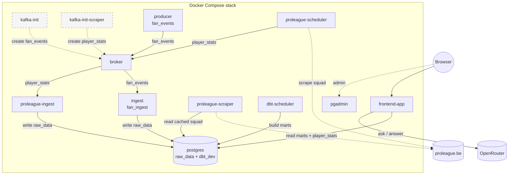

[](https://github.com/mberetvas/blauw_zwart_pipeline/actions/workflows/docker-build.yml)
[](https://github.com/mberetvas/blauw_zwart_pipeline/actions/workflows/pytest.yml)
[](https://github.com/mberetvas/blauw_zwart_pipeline/actions/workflows/ruff.yml)

# blauw-zwart-fan-sim-pipeline

This Docker Compose stack generates synthetic fan events, ingests player data, builds dbt marts, and serves a Flask UI so an operator can bring the demo online from the repo root with one command.

## Start the stack

1. Copy `.env.example` to `.env`.
2. Set the required values listed below.
3. From the repo root, run:

```bash
docker compose up -d
```

4. Open:
   - `http://localhost:8080` for the app
   - `http://localhost:5050` for pgAdmin

This README is the entry point for the stack. The sub-READMEs linked below are module-level runbooks.

## Compose service map

| Compose service | What it does | Runbook |
| --- | --- | --- |
| `broker` | Kafka broker for the `fan_events` and `player_stats` topics | [`docker/README.md`](docker/README.md) |
| `kafka-init` | One-shot creation of the `fan_events` topic | [`docker/README.md`](docker/README.md) |
| `kafka-init-scraper` | One-shot creation of the `player_stats` topic | [`docker/README.md`](docker/README.md) |
| `postgres` | Stores raw ingest tables and dbt marts | [`docker/README.md`](docker/README.md) |
| `pgadmin` | Browser admin UI for Postgres | [`docker/README.md`](docker/README.md) |
| `producer` | Runs the synthetic `fan_events` stream | [`src/fan_events/README.md`](src/fan_events/README.md) |
| `ingest` | Persists `fan_events` into `raw_data.fan_events_ingested` | [`src/fan_ingest/README.md`](src/fan_ingest/README.md) |
| `proleague-scheduler` | Scrapes Club Brugge squad data and publishes `player_stats` | [`src/proleague_scraper/README.md`](src/proleague_scraper/README.md) |
| `proleague-ingest` | Persists `player_stats` into `raw_data.player_stats` | [`src/proleague_ingest/README.md`](src/proleague_ingest/README.md) |
| `proleague-scraper` | Internal HTTP read layer for player data | [`src/proleague_scraper/README.md`](src/proleague_scraper/README.md) |
| `dbt-scheduler` | Builds dbt marts on a schedule | [`dbt/README.md`](dbt/README.md) |
| `frontend-app` | Serves the browser UI, leaderboard, player stats, and Data Q&A | [`src/frontend_app/README.md`](src/frontend_app/README.md) |

## Architecture



## Prerequisites / dependencies

| Requirement | Why it matters |
| --- | --- |
| Docker Engine / Docker Desktop with Compose | The stack is started from the repo root with `docker compose up -d`. |
| A copied `.env` file | `docker-compose.yml` reads credentials, ports, topics, and app settings from `.env`. |
| OpenRouter API access | `frontend-app` needs `OPENROUTER_API_KEY` for the Data Q&A chat. |
| Internet access to `www.proleague.be` | `proleague-scheduler` fetches the squad page and `proleague-scraper` can live-fetch player pages. |
| Approval to scrape the source site | Operators should review `https://www.proleague.be/robots.txt` and the site's terms before running the live player pipeline. |

## Key environment variables

| Variable | Set or override when | Notes |
| --- | --- | --- |
| `POSTGRES_PASSWORD` | Always set before sharing the stack or reusing volumes | Write password for `postgres` and ingest services. |
| `PGADMIN_DEFAULT_PASSWORD` | Always set before sharing the stack or reusing volumes | Login for `http://localhost:5050`. |
| `LLM_READER_PASSWORD` | Change when you rotate the read-only DB credential | Keep `LLM_READER_DATABASE_URL` aligned with the same password. |
| `LLM_READER_DATABASE_URL` | Override only if Postgres host, port, or password changes | Read-only DSN used by `frontend-app`. |
| `OPENROUTER_API_KEY` | Required for Data Q&A | Leave blank only if you are okay with the chat endpoint returning configuration errors. |
| `POSTGRES_PORT` | Override when `5432` is already in use | Host port for Postgres. |
| `PGADMIN_PORT` | Override when `5050` is already in use | Host port for pgAdmin. |
| `LLM_API_PORT` | Override when `8080` is already in use | Host port for the browser UI/API. |
| `POSTGRES_INIT_BIND_OPTS` | Set on Linux with SELinux | Use `,Z` on Fedora/RHEL; leave empty on Windows/macOS. |

## Related runbooks

| Area | README or spec |
| --- | --- |
| Compose services and operator checks | [`docker/README.md`](docker/README.md) |
| Synthetic event producer | [`src/fan_events/README.md`](src/fan_events/README.md) |
| Fan-event ingest consumer | [`src/fan_ingest/README.md`](src/fan_ingest/README.md) |
| Player scrape scheduler + internal read layer | [`src/proleague_scraper/README.md`](src/proleague_scraper/README.md) |
| Player-stats ingest consumer | [`src/proleague_ingest/README.md`](src/proleague_ingest/README.md) |
| dbt scheduler | [`dbt/README.md`](dbt/README.md) |
| Flask UI and API | [`src/frontend_app/README.md`](src/frontend_app/README.md) |
| SQL agent inside `frontend-app` | [`src/frontend_app/sql_agent/README.md`](src/frontend_app/sql_agent/README.md) |
| End-to-end Compose walkthrough | [`specs/005-compose-kafka-pipeline/quickstart.md`](specs/005-compose-kafka-pipeline/quickstart.md) |
