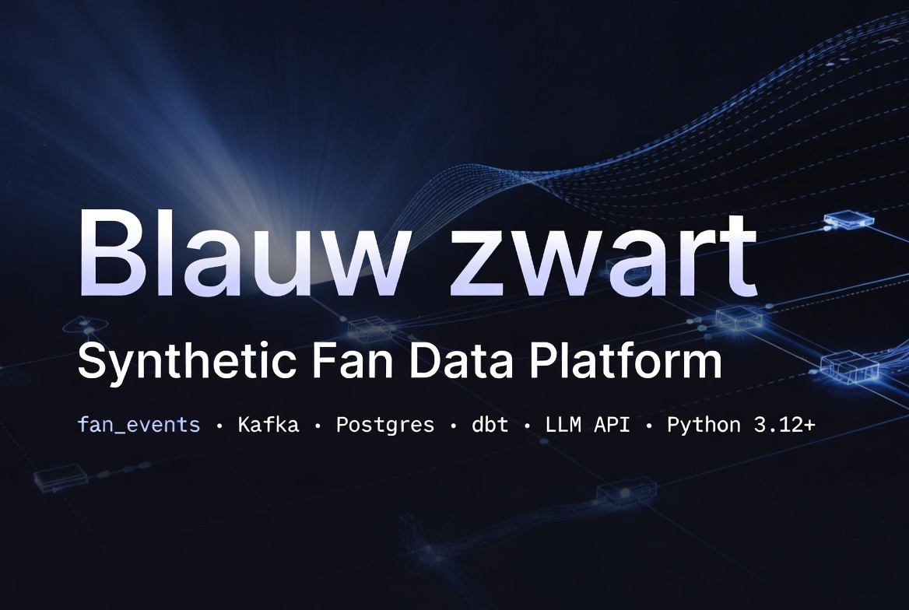

# blauw-zwart-fan-sim-pipeline

MVP / non-production sandbox for Club Brugge fan-data demos. The repo combines synthetic fan events, Kafka/Postgres ingest, a Pro League player-stats pipeline, dbt analytics, and a small Flask Text-to-SQL UI.

This is for people who want to run the local stack once, work on one package without reverse-engineering the rest, or jump straight to the right quickstart/spec.

## How to run (at a glance)

| You want… | Use this |
| --- | --- |
| **The full MVP** (Kafka, Postgres, producers, consumers, scrapers, dbt scheduler, `frontend-app`, …) | **Recommended:** from the repo root run `docker compose up -d`. Operator details: [`docker/README.md`](docker/README.md). |
| **Synthetic fan events on your machine** | **`uv run fan_events …`** after `uv sync` at the repo root — the supported *application* CLI on the host. The Compose **`producer`** service already runs `fan_events stream` when the stack is up. |
| **Tests, lint, or optional local dbt** | **`uv run pytest`**, **`uv run ruff …`**, optional **`uv run dbt …`** — development and CI workflows only; they are not how you start the demo stack (see [`dbt/README.md`](dbt/README.md)). |

## Repo layout at a glance

| Path | What lives there |
| --- | --- |
| `src/fan_events/` | Synthetic fan-event CLI: rolling batches, calendar-driven match events, retail events, and unified streams |
| `src/fan_ingest/` | Kafka consumer that persists `fan_events` into Postgres |
| `src/proleague_scraper/` | Pro League squad scraper, daily scheduler, and internal HTTP read layer |
| `src/proleague_ingest/` | Kafka consumer that upserts `player_stats` into Postgres |
| `src/frontend_app/` | Flask UI + API package: thin `app.py` orchestrator, `sql_agent/` Text-to-SQL pipeline, and static assets |
| `dbt/` | Analytics models, dbt profiles, and local dbt workflow |
| `docker-compose.yml` and `docker/` | Local operator stack, image definitions, and init SQL |

## How the pieces connect

1. `fan_events` generates synthetic fan events and can publish them to Kafka topic `fan_events`.
2. `fan_ingest` consumes `fan_events` and writes raw rows to Postgres.
3. `proleague_scraper` scrapes Club Brugge squad data, publishes `player_stats`, and serves a small internal HTTP read layer.
4. `proleague_ingest` consumes `player_stats` and upserts `raw_data.player_stats`.
5. `dbt` builds analytics models such as `mart_fan_loyalty`.
6. `frontend_app` keeps `python -m frontend_app.app` as the entrypoint; `app.py` serves the browser UI and JSON API while `sql_agent/` handles the Text-to-SQL / LLM pipeline over the dbt marts plus player stats.

### Architecture diagram

```mermaid
flowchart TD
    %% ── external actor ───────────────────────────────────────────
    user((User<br/>Browser))

    %% ── event bus ────────────────────────────────────────────────
    subgraph bus ["Event Bus"]
        broker["Kafka Broker<br/><i>KRaft · :9092</i>"]
        kafka_init["Fan Events Topic Init<br/><i>one-shot</i>"]:::init
        kafka_init_scraper["Player Stats Topic Init<br/><i>one-shot</i>"]:::init
    end

    %% ── fan events pipeline ──────────────────────────────────────
    subgraph fan ["Fan Events Pipeline"]
        producer["Fan Events Producer<br/><i>synthetic stream</i>"]
        ingest["Fan Events Ingest<br/><i>Kafka → Postgres</i>"]
    end

    %% ── pro league pipeline ──────────────────────────────────────
    subgraph pl ["Pro League Pipeline"]
        pl_scheduler["Pro League Scheduler<br/><i>daily scrape</i>"]
        pl_ingest["Pro League Ingest<br/><i>Kafka → Postgres</i>"]
        pl_scraper["Pro League API<br/><i>HTTP · :8001</i>"]
    end

    %% ── data store ───────────────────────────────────────────────
    subgraph store ["Data Store"]
        postgres[("PostgreSQL<br/><i>raw + marts</i>")]
        dbt["dbt Scheduler<br/><i>builds analytics marts</i>"]
        pgadmin["pgAdmin<br/><i>Admin UI · :5050</i>"]
    end

    %% ── presentation layer ───────────────────────────────────────
    subgraph ui ["Presentation Layer"]
        frontend["Frontend App<br/><i>Flask · :8080</i>"]
        openrouter["OpenRouter<br/><i>LLM API</i>"]:::host
    end

    %% ── topic init dependencies ──────────────────────────────────
    broker -. "ready" .-> kafka_init
    broker -. "ready" .-> kafka_init_scraper

    %% ── fan events flow ──────────────────────────────────────────
    producer -- "fan_events" --> broker
    broker -- "fan_events" --> ingest
    ingest -- "writes" --> postgres
    kafka_init -. "topic ready" .-> producer
    kafka_init -. "topic ready" .-> ingest

    %% ── pro league flow ──────────────────────────────────────────
    pl_scheduler -- "player_stats" --> broker
    broker -- "player_stats" --> pl_ingest
    pl_ingest -- "writes" --> postgres
    pl_scraper -- "reads" --> postgres
    kafka_init_scraper -. "topic ready" .-> pl_scheduler
    kafka_init_scraper -. "topic ready" .-> pl_ingest

    %% ── analytics + admin ────────────────────────────────────────
    dbt -- "transforms raw → marts" --> postgres
    pgadmin -- "admin" --> postgres

    %% ── presentation flow ────────────────────────────────────────
    frontend -- "Text-to-SQL on marts" --> postgres
    frontend -. "player detail" .-> pl_scraper
    frontend -. "LLM calls" .-> openrouter
    user -- ":8080" --> frontend
    user -. ":5050" .-> pgadmin

    %% ── styling ──────────────────────────────────────────────────
    classDef init fill:#f5f5f5,stroke:#888,color:#333,stroke-dasharray:5 5;
    classDef host fill:#eaffea,stroke:#0a7,color:#063,stroke-dasharray:2 2;
```

**Legend:** solid arrows = primary data flow; dashed arrows = readiness signals or on-demand calls. Dashed-bordered nodes are one-shot init containers; the green-bordered node is an external cloud service.

### SQL agent flow (Text-to-SQL chat)

See [`src/frontend_app/sql_agent/README.md`](src/frontend_app/sql_agent/README.md) for the full Mermaid diagram and details of the two-stage Text-to-SQL pipeline.

## Prerequisites

| Requirement | Why it matters |
| --- | --- |
| Python 3.12+ | Needed for **`fan_events`** on the host, tests, and other **development** workflows |
| [uv](https://docs.astral.sh/uv/) | Lockfile and toolchain for the **`fan_events`** CLI on the host, plus **development** commands (`uv run pytest`, `uv run dbt`, …) |
| Docker + Docker Compose | **Recommended** way to run the **full MVP stack** (all long-running services) |
| [just](https://just.systems/) | Optional convenience wrapper around common stack and CLI commands |

## Run the full MVP stack (recommended)

1. Copy `.env.example` to `.env` (`Copy-Item .env.example .env` in PowerShell).
   - Set `POSTGRES_INIT_BIND_OPTS` for your OS:
     - Linux with SELinux (Fedora/RHEL): `POSTGRES_INIT_BIND_OPTS=,Z`
     - Windows/macOS Docker Desktop: `POSTGRES_INIT_BIND_OPTS=`
2. Edit the required `.env` values before your first `docker compose up -d`:
   - **Must set**
     - `POSTGRES_INIT_BIND_OPTS` (OS-specific as above)
     - `OPENROUTER_API_KEY` (required for the Data Q&A chat)
   - **Should change for any real/shared setup**
     - `POSTGRES_PASSWORD`
     - `PGADMIN_DEFAULT_PASSWORD`
     - `LLM_READER_PASSWORD` and matching password inside `LLM_READER_DATABASE_URL`
   - **Change only if needed**
     - `POSTGRES_PORT`, `PGADMIN_PORT`, `LLM_API_PORT` (if host ports are already in use)
3. Start **everything** from the repo root with `docker compose up -d` (not `uv run` for services).
4. Open <http://localhost:8080>.

That path starts Kafka, Postgres, pgAdmin, the fan-event producer/consumer pair, the player-stats scraper/consumer pair, the dbt scheduler, and `frontend-app`. For service-by-service notes, ports, env vars, and operator commands, use [`docker/README.md`](docker/README.md).

**Development / CI on the host:** `uv run pytest` and `uv run ruff check .` from the repo root — these do not replace Docker Compose for running the stack.

## Documentation map

| Component | README path | What you find there |
| --- | --- | --- |
| `fan_events` | [`src/fan_events/README.md`](src/fan_events/README.md) | CLI modes, install options, common commands, Kafka output notes, and links to the fan-event specs |
| `fan_ingest` | [`src/fan_ingest/README.md`](src/fan_ingest/README.md) | Kafka-to-Postgres ingest flags, env vars, host-vs-Compose connection notes, and persistence docs |
| `proleague_scraper` | [`src/proleague_scraper/README.md`](src/proleague_scraper/README.md) | Scheduler + HTTP read layer, internal routes, env vars, scrape workflow, and compliance notes |
| `proleague_ingest` | [`src/proleague_ingest/README.md`](src/proleague_ingest/README.md) | `player_stats` consumer behavior, message shape, Postgres table summary, and verification commands |
| `frontend_app` | [`src/frontend_app/README.md`](src/frontend_app/README.md) | Flask UI/API usage, provider config, Text-to-SQL flow, routes, screenshots, guardrails, and package split notes |
| `dbt` | [`dbt/README.md`](dbt/README.md) | Local dbt setup, Compose dbt scheduler notes, profiles, env vars, and Windows-specific dbt guidance |
| Local stack | [`docker/README.md`](docker/README.md) | Compose services, published ports, `.env` knobs, operator commands, `just` wrappers, and stack troubleshooting |

Note: no license file is currently present in the repository root.
