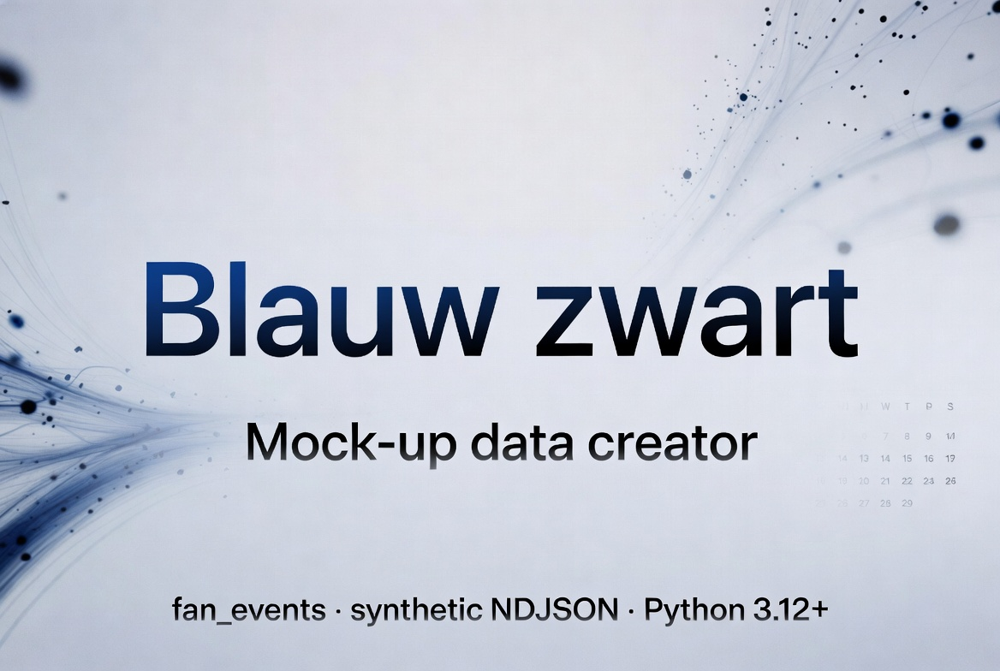

# Blauw zwart - Mock-up data creator

Synthetic fan events are produced by the `fan_events` package (`src/fan_events/`). The CLI exposes two subcommands: **`generate_events`** (match-related **v1** rolling window or **v2** calendar) and **`generate_retail`** (**v3** match-independent retail). Run commands from the **repository root** after `uv sync`, using either `uv run fan_events …` or `uv run python -m fan_events …`.

Or you can install the package using

```
uv tool install blauw-zwart-fan-sim-pipeline --from git+https://github.com/mberetvas/blauw_zwart_pipeline
```

After installation, the `fan_events` entry point is on your `PATH`. Use the same arguments as below without the `uv run` prefix (for example `fan_events generate_events -s 1 -o out/v1.ndjson` or `fan_events generate_retail -s 1 -o out/retail.ndjson`).

## CLI overview


| Mode             | When | Output contract |
| ---------------- | ---- | ---------------- |
| **v1** (default) | `generate_events` without `-c` / `--calendar` | Rolling UTC window — no `match_id` on lines |
| **v2** | `generate_events -c` / `--calendar …` | Match calendar — every line has `match_id` |
| **v3 retail** | `generate_retail` | `retail_purchase` only — [`fan-events-ndjson-v3.md`](specs/003-ndjson-v3-retail-sim/contracts/fan-events-ndjson-v3.md) |

```bash
# After `uv sync` at the repo root
uv run fan_events generate_events [options]
uv run fan_events generate_retail [options]

# Installed package: same commands without `uv run`
fan_events generate_events [options]
fan_events generate_retail [options]
```

## Parameters and defaults

Flags are **subcommand-specific**: use a **separate** invocation per subcommand. Options that belong to `generate_events` only (for example `--calendar`, `--count`, `--days`, `--events`) are **not** valid on `generate_retail`—see **`fan_events generate_retail --help`** for the v3 flag list.

### Same letter, different meaning (`-n` and `-d`)

| Short | `generate_events` | `generate_retail` |
| ----- | ----------------- | ----------------- |
| **`-n`** | `--count` (total events, v1) | `--max-events` (cap; implied default **200** when unset—see v3 table) |
| **`-d`** | `--days` (rolling window length, v1) | `--max-duration` (simulated seconds from epoch for record timestamps) |

Always check which subcommand you are using. **`fan_events generate_events --help`** and **`fan_events generate_retail --help`** list the authoritative short/long pairs.

### `generate_events` (v1 / v2)

| Argument | Default | Description |
| -------- | ------- | ----------- |
| `-o`, `--output` | `out/fan_events.ndjson` | Output NDJSON path |
| `-s`, `--seed` | *(none)* | RNG seed; **v1** also fixes “now” for repeatable output when set. Omit for non-deterministic v1/v2 |
| `-e`, `--events` | `both` | `both`, `ticket_scan`, or `merch_purchase` |
| `-F`, `--fans-out` | *(none)* | Optional **companion JSON** path: synthetic fan master (`schema_version`, `rng_seed`, `fans` map). **Not** part of the NDJSON contracts — join on `fan_id` (`events.fan_id` → `fans[fan_id]`). Same `--seed` and same `fan_id` → same profile; profile RNG is separate from event RNG (v3 retail draw order unchanged). Only includes `fan_id`s that **appear in emitted events** |

**v1 only** (do not combine with `-c` / `--calendar`):

| Argument | Default | Description |
| -------- | ------- | ----------- |
| `-n`, `--count` | `200` | Total events to emit |
| `-d`, `--days` | `90` | UTC rolling window length ending at generation time |

**v2 only** (`-c` / `--calendar` required for calendar mode):

| Argument | Default | Description |
| -------- | ------- | ----------- |
| `-c`, `--calendar` | *(none)* | Path to calendar JSON (see below); omit for v1 rolling |
| `--from-date` / `--to-date` | *(none)* | Inclusive kickoff UTC date filter (`YYYY-MM-DD`). **Omit both** to include every match; if you set one, set both |
| `--scan-fraction` | `0.85` when omitted | With calendar: scales `ticket_scan` volume vs capacity (`fan_events.domain`) |
| `--merch-factor` | `0.25` when omitted | With calendar: scales `merch_purchase` volume vs capacity (`fan_events.domain`) |

**`generate_events` validation (argparse)**

- **`--from-date` and `--to-date`**: must both be set or both omitted.
- **`--scan-fraction` / `--merch-factor`**: require `-c` / `--calendar`.
- **Rolling vs calendar**: you cannot combine `-c` / `--calendar` with rolling window flags (`-n` / `--count`, `-d` / `--days`, etc.); the CLI errors with a message equivalent to *`-n` / `--count` / `-d` / `--days` cannot be used with `--calendar`*.

### `generate_retail` (v3)

Match-independent `retail_purchase` lines (three shop channels). **Batch** (default) writes a **globally sorted** file to `-o` / `--output`. **`-t` / `--stream`** writes **stdout** in generation order (no global sort). Without wall-clock flags, stream output is written **as fast as the CPU allows** (same seed → byte-identical stream output across repeated runs for equivalent limits, but batch vs stream ordering/bytes may differ because batch applies a global sort and stream does not). With **`--emit-wall-clock-min`** and **`--emit-wall-clock-max`**, the process **sleeps** a random number of seconds in `[min, max]` before each line **after the first** (draw uses the same RNG as `-s` / `--seed`). Default synthetic timeline start when **`-E` / `--epoch`** is omitted is **`2026-01-01T00:00:00Z`** (same as the v3 generator).

| Argument | Default | Description |
| -------- | ------- | ----------- |
| `-o`, `--output` | `out/retail.ndjson` | Output path; ignored when **`-t` / `--stream`** |
| `-s`, `--seed` | *(none)* | RNG seed for batch, stream, and wall-clock sleep intervals; omit for non-deterministic output |
| `-t`, `--stream` | off | Write NDJSON to stdout; default is a sorted batch file to `-o` |
| `-n`, `--max-events` | *(none)* | Stop after N events (`0` → empty). **Not** compatible with **`-u` / `--unlimited`**. If **omitted** with no **`-d`** and no **`-u`**, the generator applies implied **200**; if **`-d`** is set without `-n`, only the simulated duration limits events |
| `-d`, `--max-duration` | *(none)* | Max **simulated** seconds from epoch for timestamps (`SECONDS`). With `-n`, stop when **either** limit hits first |
| `-E`, `--epoch` | `2026-01-01T00:00:00Z` when omitted | UTC start instant for the synthetic timeline (ISO-8601) |
| `--shop-weights` `W1` `W2` `W3` | equal **1/3** per shop when omitted | Non-negative weights (order: jan_breydel_fan_shop, webshop, bruges_city_shop) |
| `--arrival-mode` | `poisson` | Synthetic inter-arrival model: `poisson`, `fixed`, or `weighted_gap` |
| `--poisson-rate` | `0.1` | Events per second for Poisson gaps when mode is `poisson` |
| `--fixed-gap-seconds` | `60` | Seconds between synthetic events when mode is `fixed` |
| `--weighted-gaps` / `--weighted-gap-weights` | *(none)* | Candidate gaps and weights for `weighted_gap`; **both** required when using that mode |
| `-p`, `--fan-pool` | *(none)* | Upper bound for `fan_id` suffix pool; when omitted, heuristic from implied cap (typically up to **500**) |
| `--emit-wall-clock-min` / `--emit-wall-clock-max` | *(none)* | **Require `-t` / `--stream`**, **both** together; wall-clock seconds between lines after the first |
| `-u`, `--unlimited` | off | Skip the implied **200** event cap when `-n` and `-d` are both omitted; **incompatible with `-n`**. With **`-t`**, requires wall-clock emit bounds and/or **`-d`**; without **`-t`**, requires **`-d`** |
| `-F`, `--fans-out` | *(none)* | Same companion **fan master JSON** as `generate_events` (join on `fan_id`; not normative NDJSON). See **`generate_events`** table |

**Stopping rules (v3 generator)**

If **`-n` / `--max-events`** and **`-d` / `--max-duration`** are both set, generation stops when **either** binds first. If **both** are omitted and **`-u` / `--unlimited`** is **not** set, the implied cap is **200** events. If only **`-d`** is set, event count is unconstrained until the simulated duration window is exceeded. With **`-u`** and **`-t`**, you can run until Ctrl+C using only wall-clock emit bounds, or cap the simulated timeline with **`-d`**, or both.

**`generate_retail` validation (argparse)**

- **`--emit-wall-clock-min` / `--emit-wall-clock-max`**: must appear together; require **`-t` / `--stream`**; `min ≤ max`, both `≥ 0`.
- **`-u` / `--unlimited`**: cannot be combined with **`-n` / `--max-events`**. With **`-t`**, you must also pass wall-clock emit bounds **or** **`-d` / `--max-duration`**. Without **`-t`**, **`-d`** is required.
- **V1/v2-only long flags** (for example `--calendar`, `--count`, `--days`, `--events`) are not valid on `generate_retail`; the CLI reports that they belong under `generate_events`.

Normative detail and extra examples: [`specs/003-ndjson-v3-retail-sim/quickstart.md`](specs/003-ndjson-v3-retail-sim/quickstart.md).

## Examples

Use `uv run fan_events` from the repo root after `uv sync`. If you installed the package, run **`fan_events`** with the same arguments (omit `uv run`).

**v1** (rolling window)

```bash
uv run fan_events generate_events -s 1 -n 200 -d 90 -o out/v1.ndjson
```

**v2** (all matches in the calendar file)

```bash
uv run fan_events generate_events -c my_calendar.json -s 42 -o out/v2.ndjson
```

**v2** (date range on kickoff UTC)

```bash
uv run fan_events generate_events -c my_calendar.json \
  --from-date 2026-09-01 --to-date 2026-12-31 -s 42 -o out/v2.ndjson
```

**v3** (batch to file)

```bash
uv run fan_events generate_retail -o out/retail.ndjson -s 42
```

**v3** (stream to stdout, immediate)

```bash
uv run fan_events generate_retail -t -s 42 -n 100
```

**v3** (stream to stdout with random wall-clock delay between lines)

```bash
uv run fan_events generate_retail -t -s 42 -n 50 \
  --emit-wall-clock-min 0.5 --emit-wall-clock-max 2.0
```

**v3** (stream indefinitely with real-time pacing until Ctrl+C)

```bash
uv run fan_events generate_retail -t -u -s 42 \
  --emit-wall-clock-min 1 --emit-wall-clock-max 5
```

## Match calendar JSON (v2 input)

UTF-8 JSON with a top-level `matches` array. Each object **must** include:


| Field           | Type    | Notes                                                     |
| --------------- | ------- | --------------------------------------------------------- |
| `match_id`      | string  | Unique in the file                                        |
| `kickoff_local` | string  | Naive local datetime, e.g. `2026-08-15T18:30:00` (no `Z`) |
| `timezone`      | string  | IANA zone, e.g. `Europe/Brussels`                         |
| `attendance`    | integer | `> 0`; for `home` at Jan Breydel, ≤ **29,062**            |
| `home_away`     | string  | `home` or `away`                                          |
| `venue_label`   | string  | Used in output locations                                  |


**Optional** per match: `window_start_offset_minutes` (default **120**), `window_end_offset_minutes` (default **90**), `competition`, `opponent`.

Template (required fields only):

```json
{
  "matches": [
    {
      "match_id": "m-001",
      "kickoff_local": "2026-08-15T18:30:00",
      "timezone": "Europe/Brussels",
      "attendance": 500,
      "home_away": "home",
      "venue_label": "Jan Breydel Stadium"
    }
  ]
}
```

## v2: UTC timestamps and the match window

Read this before comparing **output** times to `kickoff_local` in the calendar.

1. **Every `timestamp` in the NDJSON is UTC** (ISO-8601 with a `Z` suffix). It is **not** local stadium time. To reason in local time, convert `Z` times to `timezone` (or convert kickoff to UTC and compare in UTC only).
2. **Kickoff** is the instant `kickoff_local` interpreted in `timezone`, then converted to UTC. All window math uses that **kickoff UTC** instant.
3. **Default event window** (unless you set `window_start_offset_minutes` / `window_end_offset_minutes` on the match): from **120 minutes before** kickoff UTC to **90 minutes after** kickoff UTC. Synthetic event times are picked uniformly at random inside that closed interval.
4. **Example:** `kickoff_local` `2026-08-15T18:30:00` with `Europe/Brussels` in summer (CEST, UTC+2) → kickoff **16:30 UTC**. Window → **14:30Z** … **18:00Z**. In Brussels wall-clock time that is about **16:30–20:00**, not the same numbers as the `Z` strings read naively as local time.

## Fan master sidecar (`-F` / `--fans-out`)

Optional **single JSON document** (canonical serialization, UTF-8, trailing newline). Use it when consumers need stable synthetic attributes per `fan_id` without changing event lines.

- **Join**: each NDJSON event line has `fan_id`; look up **`fans["fan_00042"]`** (or equivalent) in the sidecar’s `fans` object.
- **Determinism**: with the same CLI **`--seed`**, the same `fan_id` always gets the same profile fields. Without `--seed`, profiles are still stable per `fan_id` (derived without the process `hash()`). Event bytes are unchanged whether or not you pass `-F`.
- **Scope**: only fans that appear in **that run’s** output (empty `fans` if there are zero events).

## Expected output

- **File**: UTF-8, Unix line endings, **one JSON object per line**, newline after the last line.
- **Serialization**: Canonical JSON (`sort_keys`, compact separators, non-ASCII preserved).
- **v1 lines**: `ticket_scan` and/or `merch_purchase` records **without** `match_id` (see `specs/001-synthetic-fan-events/contracts/fan-events-ndjson-v1.md`).
- **v2 lines**: Same event types; **every** record includes `match_id`; timestamps are UTC with a `Z` suffix (**see [v2: UTC timestamps and the match window](#v2-utc-timestamps-and-the-match-window)**); global line order follows the v2 contract (see `specs/002-match-calendar-events/contracts/fan-events-ndjson-v2.md`).
- **v3 lines**: `retail_purchase` only, closed six-field schema; batch output is globally sorted (see `specs/003-ndjson-v3-retail-sim/contracts/fan-events-ndjson-v3.md`). Stream mode (`-t` / `--stream`) can emit lines immediately or with wall-clock delays (`--emit-wall-clock-min` / `--emit-wall-clock-max`).
- **Empty output**: If v2 date filtering removes all matches, the file is **empty** (zero bytes). Retail with `-n 0` / `--max-events 0` yields an **empty** file or no stdout bytes in stream mode. With **`-F` / `--fans-out`**, the sidecar is still written: `fans` is `{}`, with `rng_seed` and `schema_version` set.

Normative details: `specs/001-synthetic-fan-events/` (v1), `specs/002-match-calendar-events/` (v2), `specs/003-ndjson-v3-retail-sim/` (v3). Governance: [.specify/memory/constitution.md](.specify/memory/constitution.md).
