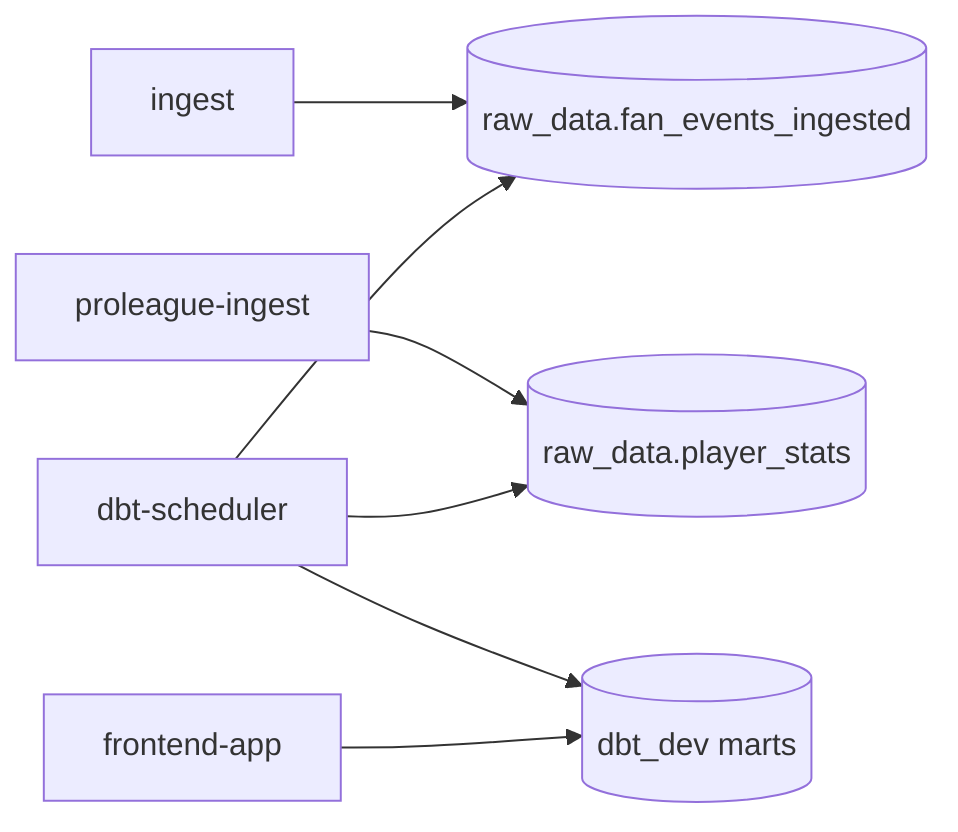

# dbt analytics

This module turns raw fan and player tables into dbt marts so the UI and SQL agent can query one Postgres database with stable, analytics-ready models.

Start the stack from [`../README.md`](../README.md); this runbook covers the `dbt-scheduler` service that Compose starts for you.

## Compose service mapping

| Compose service | Role |
| --- | --- |
| `dbt-scheduler` | Runs scheduled dbt builds against the shared `postgres` service |

## How this module fits the stack



## Prerequisites / dependencies

| Dependency | Why it matters |
| --- | --- |
| `postgres` | dbt reads raw tables and writes marts in the same database. |
| `ingest` | Supplies `raw_data.fan_events_ingested`. |
| `proleague-ingest` | Supplies `raw_data.player_stats`. |
| `frontend-app` | Reads dbt marts for the leaderboard and the SQL agent. |

## Key environment variables

| Variable | Override when | Notes |
| --- | --- | --- |
| `DBT_RUN_INTERVAL_MINUTES` | You want faster or slower refreshes | Controls the scheduler loop interval. |
| `DBT_RUN_SELECTOR` | You want a different primary dbt selection | Defaults to `+tag:mart`. |
| `DBT_RUN_POST_BUILD_SELECTOR` | You want a different follow-up selector | Defaults to `tag:observability`. |
| `DBT_TARGET_SCHEMA` | You need marts in a different schema | Defaults to `dbt_dev`. |

## Operator check

```bash
docker compose logs -f dbt-scheduler
```

## Related runbooks

| Area | README or spec |
| --- | --- |
| Stack entry point | [`../README.md`](../README.md) |
| Compose service runbook | [`../docker/README.md`](../docker/README.md) |
| Flask UI and API | [`../src/frontend_app/README.md`](../src/frontend_app/README.md) |
| SQL agent | [`../src/frontend_app/sql_agent/README.md`](../src/frontend_app/sql_agent/README.md) |
