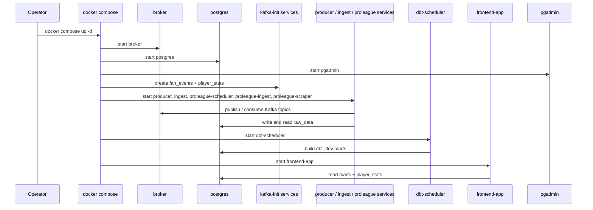

# Docker Compose runbook

This runbook explains how the services in `docker-compose.yml` behave after you start the stack once from the repo root.

Start the stack from [`../README.md`](../README.md); use this file for service-level checks, logs, and shutdown.

## Compose service mapping

| Compose service | Kind | Published port | Why it is here |
| --- | --- | --- | --- |
| `broker` | Long-running | `9092` | Kafka broker for both topics |
| `kafka-init` | One-shot | — | Creates `fan_events` before producer and consumer start |
| `kafka-init-scraper` | One-shot | — | Creates `player_stats` before scheduler and consumer start |
| `postgres` | Long-running | `${POSTGRES_PORT:-5432}` | Shared database for raw tables and dbt marts |
| `pgadmin` | Long-running | `${PGADMIN_PORT:-5050}` | Browser admin UI for Postgres |
| `producer` | Long-running | — | Emits synthetic `fan_events` into Kafka |
| `ingest` | Long-running | — | Consumes `fan_events` into Postgres |
| `proleague-scheduler` | Long-running | — | Scrapes Club Brugge squad data into Kafka |
| `proleague-ingest` | Long-running | — | Consumes `player_stats` into Postgres |
| `proleague-scraper` | Long-running | — | Internal HTTP read layer for player data |
| `dbt-scheduler` | Long-running | — | Rebuilds dbt marts on a schedule |
| `frontend-app` | Long-running | `${LLM_API_PORT:-8080}` | Host-facing UI and Data Q&A API |

## Service startup flow



## Prerequisites / dependencies

| Requirement | Why it matters |
| --- | --- |
| [`../README.md`](../README.md) | The repo root is the canonical place to start the stack. |
| `.env` copied from `.env.example` | Service credentials, ports, and runtime settings come from `.env`. |
| Named Docker volumes | `kafka-data`, `postgres-data`, `frontend-app-config`, and `producer-bootstrap-state` keep state across restarts. |
| OpenRouter API access | `frontend-app` needs `OPENROUTER_API_KEY` for chat requests. |

## Key environment variables

| Variable | Override when | Affects |
| --- | --- | --- |
| `POSTGRES_PORT` | Host port `5432` is busy | `postgres` |
| `PGADMIN_PORT` | Host port `5050` is busy | `pgadmin` |
| `LLM_API_PORT` | Host port `8080` is busy | `frontend-app` |
| `KAFKA_TOPIC` | You want a different synthetic event topic name | `kafka-init`, `producer`, `ingest` |
| `SCRAPER_KAFKA_TOPIC` | You want a different player topic name | `kafka-init-scraper`, `proleague-scheduler`, `proleague-ingest` |
| `OPENROUTER_API_KEY` | You want Data Q&A to work | `frontend-app` |

## Common operator commands

```bash
docker compose ps
docker compose logs -f frontend-app
docker compose down
docker compose down -v
```

## Related runbooks

| Area | README or spec |
| --- | --- |
| Stack entry point | [`../README.md`](../README.md) |
| Synthetic event producer | [`../src/fan_events/README.md`](../src/fan_events/README.md) |
| Fan-event ingest consumer | [`../src/fan_ingest/README.md`](../src/fan_ingest/README.md) |
| Player scrape scheduler + internal read layer | [`../src/proleague_scraper/README.md`](../src/proleague_scraper/README.md) |
| Player-stats ingest consumer | [`../src/proleague_ingest/README.md`](../src/proleague_ingest/README.md) |
| dbt scheduler | [`../dbt/README.md`](../dbt/README.md) |
| Flask UI and API | [`../src/frontend_app/README.md`](../src/frontend_app/README.md) |
| Compose quickstart spec | [`../specs/005-compose-kafka-pipeline/quickstart.md`](../specs/005-compose-kafka-pipeline/quickstart.md) |
