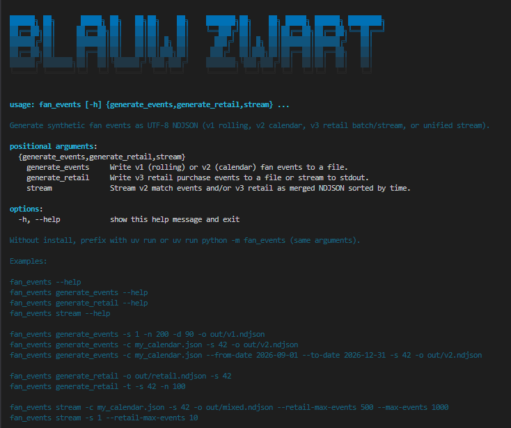
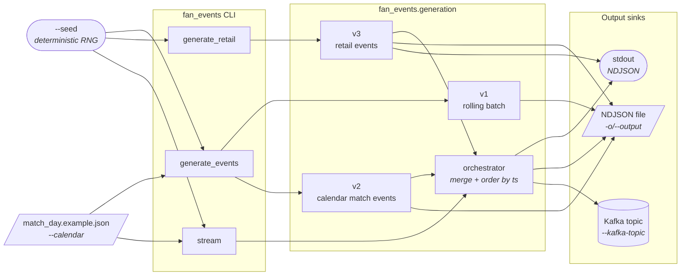

# fan_events

Synthetic fan-event generator CLI. This package owns the current event-generation surface: rolling batches (v1), calendar-driven match events (v2), retail events (v3), and the merged `stream` command.

## CLI help

From the repo root after `uv sync`, run **`uv run fan_events --help`** (or `uv run python -m fan_events --help`) for usage, subcommands, and copy-paste examples:



## How to run (at a glance)

| | |
| --- | --- |
| **Full stack** | From the repo root: **`docker compose up -d`** — the Compose **`producer`** service runs `fan_events stream` for you. See [`../../docker/README.md`](../../docker/README.md). |
| **This CLI on your machine** | **`uv run fan_events …`** (or `uv run python -m fan_events …`) after `uv sync` at the repo root — the supported **host** entrypoint for generating streams or NDJSON outside Compose. |

## High-level flow



**Reading the diagram:** `generate_events` covers v1 rolling batches and v2 calendar batches; `generate_retail` covers v3 retail (file or `--stream` to stdout); `stream` merges v2 + v3 in timestamp order and can target stdout, a file, or Kafka (mutually exclusive with `-o/--output`).

## What lives here

### Package layout

The package is organized into layered subpackages with a strict import DAG: **core → io → generation → cli** (sinks is optional, one-way from CLI).

| Subpackage | Contents | Purpose |
| --- | --- | --- |
| `fan_events.core` | `data.py`, `domain.py` | Structured catalogs (merch items, stadium gates, shops) and domain constants |
| `fan_events.io` | `ndjson_io.py`, `merge_keys.py` | NDJSON serialization, validation, atomic file writes, and merge-key ordering |
| `fan_events.generation` | `v1_batch.py`, `v2_calendar.py`, `v3_retail.py`, `retail_intensity.py`, `fan_profiles.py`, `orchestrator.py` | Synthetic event generators (v1 rolling, v2 calendar, v3 retail), match-day intensity, fan profiles, and merged-stream orchestrator |
| `fan_events.cli` | `main.py`, `term_style.py` | Argparse CLI wiring and TTY-aware ANSI styling |
| `fan_events.sinks` | `kafka_sink.py` | Kafka producer sink (optional; requires `confluent-kafka`) |

### Subcommands

| Subcommand | What it does |
| --- | --- |
| `generate_events` | Rolling-window fan events (v1) or calendar-driven match events (v2) |
| `generate_retail` | Retail-only NDJSON generation (v3) |
| `stream` | Unified v2 + v3 stream to stdout, file, or Kafka |

Run `uv run fan_events <subcommand> --help` for the full flag set and copy-paste examples.

## Install

Base CLI:

```bash
uv sync
uv run fan_events --help
```

Add Kafka support only when you need native Kafka output from `stream --kafka-topic`:

```bash
uv sync --extra kafka
```

## Common commands

```bash
uv run fan_events generate_events --help
uv run fan_events generate_retail --help
uv run fan_events stream --help
```

| Goal | Command |
| --- | --- |
| v1 rolling-window batch | `uv run fan_events generate_events -s 1 -n 200 -d 90 -o out/fan_events.ndjson` |
| v2 calendar batch | `uv run fan_events generate_events --calendar match_day.example.json -s 42 -o out/v2.ndjson` |
| v3 retail batch | `uv run fan_events generate_retail -s 42 -o out/retail.ndjson` |
| v3 retail stream to stdout | `uv run fan_events generate_retail --stream -s 42 --max-events 100` |
| Merged stream to stdout | `uv run fan_events stream --calendar match_day.example.json -s 42 --retail-max-events 500 --max-events 200` |
| Merged stream to a file | `uv run fan_events stream --calendar match_day.example.json -s 42 -o out/mixed.ndjson --retail-max-events 500 --max-events 200` |
| Merged stream to Kafka | `uv run fan_events stream --calendar match_day.example.json -s 42 --kafka-topic fan_events --kafka-bootstrap-servers localhost:9092 --max-events 200` |

If you prefer `just`, the repo already wraps the most common flows in [`justfile`](../../justfile):

| Recipe | What it does |
| --- | --- |
| `just stream` | Merged stdout stream with the repo calendar |
| `just stream-calendar` | Calendar-only stdout stream |
| `just stream-loop` | Continuous calendar loop to stdout |
| `just stream-loop-merged` | Continuous merged loop to stdout |
| `just stream-retail` | Retail-only stdout stream |
| `just stream-kafka` | Host-side Kafka publishing via `fan_events stream` |
| `just stream-kafka-live` | Host-side Kafka publishing with wall-clock pacing |
| `just generate-events` | v1 rolling batch |
| `just generate-calendar` | v2 calendar batch |
| `just generate-retail` | v3 retail batch |

## Runtime behavior that matters

| Topic | Current behavior |
| --- | --- |
| Calendar looping | With `--calendar`, `stream` loops the season by default; add `--no-calendar-loop` for a single pass |
| Output targets | `stream` writes to stdout when `-o/--output` is omitted; `--kafka-topic` is mutually exclusive with `-o/--output` |
| Kafka addresses | Host commands use `localhost:9092`; Compose services use `broker:29092` |
| Match-day retail tuning | Feature 006 adds extra retail tuning flags for match days; use the linked contracts below for the exact knobs |

## Environment variables

CLI flags override environment values when both are set.

| Variable | Default | When to care |
| --- | --- | --- |
| `FAN_EVENTS_KAFKA_BOOTSTRAP_SERVERS` | `localhost:9092` | Native Kafka output without repeating `--kafka-bootstrap-servers` |
| `FAN_EVENTS_KAFKA_TOPIC` | unset | Default Kafka topic for `stream --kafka-topic` mode |
| `FAN_EVENTS_KAFKA_CLIENT_ID` | `fan-events-producer` | Producer identity in broker logs |
| `FAN_EVENTS_KAFKA_COMPRESSION` | `none` | Compression tuning for Kafka output |
| `FAN_EVENTS_KAFKA_ACKS` | `1` | Producer acknowledgement policy |
| `FAN_EVENTS_KAFKA_SECURITY_PROTOCOL` | unset | TLS / SASL broker setups |
| `FAN_EVENTS_KAFKA_SASL_MECHANISM` | unset | TLS / SASL broker setups |
| `FAN_EVENTS_KAFKA_SASL_USERNAME` | unset | TLS / SASL broker setups |
| `FAN_EVENTS_KAFKA_SASL_PASSWORD` | unset | TLS / SASL broker setups |
| `FAN_EVENTS_KAFKA_PROGRESS_INTERVAL` | `256` | Periodic delivery summaries; set `0` to disable |
| `FAN_EVENTS_LOG_LEVEL` | unset | Package-specific log level override |
| `LOGLEVEL` | unset | Fallback log level |
| `NO_COLOR` / `FORCE_COLOR` | unset | Help/TTY color control |

## Troubleshooting

| Problem | What to check |
| --- | --- |
| `stream --kafka-topic ...` fails immediately | Install the Kafka extra first: `uv sync --extra kafka` |
| You only want one calendar pass | Add `--no-calendar-loop` |
| Host Kafka publishing cannot connect | Use `localhost:9092`, not `broker:29092` |
| Compose service cannot connect to Kafka | Inside Compose, use `broker:29092`, not `localhost:9092` |

## Related docs

- [`../../README.md`](../../README.md) - repo-level overview and where this package fits
- [`../../docker/README.md`](../../docker/README.md) - full local stack and operator commands
- [`../fan_ingest/README.md`](../fan_ingest/README.md) - downstream Kafka → Postgres consumer for the `fan_events` topic
