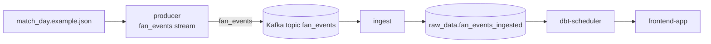

# fan_events

This module generates the synthetic supporter activity that feeds the rest of the demo stack with Kafka events.

Start the stack from [`../../README.md`](../../README.md); this runbook covers the `producer` service that Compose starts for you.

## Compose service mapping

| Compose service | Role |
| --- | --- |
| `producer` | Runs the merged match-day and retail `fan_events` stream |

## How this module fits the stack



## Prerequisites / dependencies

| Dependency | Why it matters |
| --- | --- |
| `broker` | `producer` publishes to Kafka. |
| `kafka-init` | Creates the `fan_events` topic before `producer` starts. |
| `match_day.example.json` | Provides the calendar used by the default stream inside Compose. |
| `ingest` | Consumes the topic and makes the data durable in Postgres. |

## Key environment variables

| Variable | Override when | Notes |
| --- | --- | --- |
| `KAFKA_TOPIC` | You want a different topic name | Must stay aligned with `ingest`. |
| `FAN_EVENTS_STREAM_SEED` | You want a different deterministic run | Defaults to `42`. |
| `FAN_EVENTS_BOOTSTRAP_ENABLED` | You want to disable the one-time bootstrap stream | Default is `1`. |
| `FAN_EVENTS_BOOTSTRAP_INCLUDE_RETAIL` | You want retail events in the bootstrap phase | Default is `0`. |
| `FAN_EVENTS_BOOTSTRAP_MAX_EVENTS` | You want to cap the bootstrap volume | Unset means no explicit event cap. |
| `FAN_EVENTS_BOOTSTRAP_MAX_DURATION_SECONDS` | You want to cap bootstrap runtime | Unset means no explicit duration cap. |

## Operator check

```bash
docker compose logs -f producer
```

## Related runbooks

| Area | README or spec |
| --- | --- |
| Stack entry point | [`../../README.md`](../../README.md) |
| Compose service runbook | [`../../docker/README.md`](../../docker/README.md) |
| Downstream fan-event ingest | [`../fan_ingest/README.md`](../fan_ingest/README.md) |
| Compose quickstart spec | [`../../specs/005-compose-kafka-pipeline/quickstart.md`](../../specs/005-compose-kafka-pipeline/quickstart.md) |
