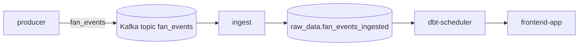

# fan_ingest

This module consumes synthetic `fan_events` from Kafka and stores them in Postgres so dbt and the UI have durable raw data to work from.

Start the stack from [`../../README.md`](../../README.md); this runbook covers the `ingest` service that Compose starts for you.

## Compose service mapping

| Compose service | Role |
| --- | --- |
| `ingest` | Consumes `fan_events` and writes raw rows into Postgres |

## How this module fits the stack



## Prerequisites / dependencies

| Dependency | Why it matters |
| --- | --- |
| `broker` | `ingest` consumes from Kafka inside the Compose network. |
| `kafka-init` | Creates the `fan_events` topic before the consumer subscribes. |
| `postgres` | `ingest` writes durable raw rows into the shared database. |
| `producer` | Supplies the default synthetic event stream. |

## Key environment variables

| Variable | Override when | Notes |
| --- | --- | --- |
| `KAFKA_BOOTSTRAP_SERVERS` | Kafka lives somewhere other than `broker:29092` | Compose default is already correct for the local stack. |
| `KAFKA_TOPIC` | You want a different topic name | Must stay aligned with `producer` and `kafka-init`. |
| `KAFKA_CONSUMER_GROUP` | You want a different consumer-group identity | Default is `fan-ingest-local`. |
| `DATABASE_URL` | Postgres host, port, database, or password changes | Must point to a write-capable Postgres role. |

## Operator check

```bash
docker compose logs -f ingest
```

## Related runbooks

| Area | README or spec |
| --- | --- |
| Stack entry point | [`../../README.md`](../../README.md) |
| Compose service runbook | [`../../docker/README.md`](../../docker/README.md) |
| Upstream synthetic producer | [`../fan_events/README.md`](../fan_events/README.md) |
| dbt scheduler | [`../../dbt/README.md`](../../dbt/README.md) |
