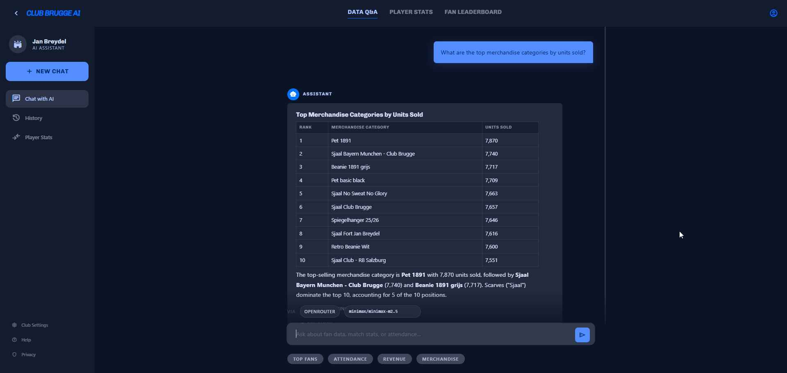
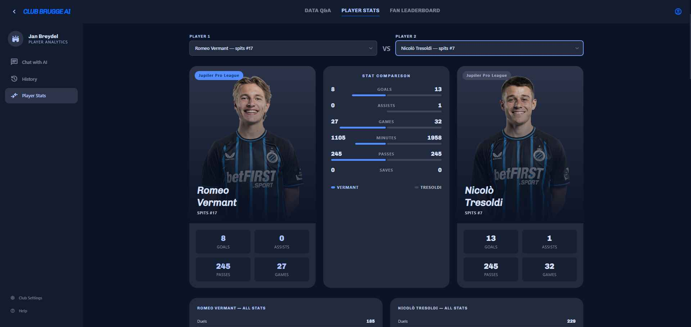

# frontend_app

Flask UI + JSON API for the MVP demo. This package serves the Data Q&A chat, the fan leaderboard, the player-stats page, and the settings page that persists runtime LLM configuration.

Current package split:

- `app.py` remains the thin Flask HTTP/UI orchestrator and the runtime entrypoint (`python -m frontend_app.app`).
- `sql_agent/` is a tool-calling LangChain + LangGraph agent (OpenRouter only). It owns the data tools, sqlglot guardrails, and graph orchestration that turns a question into a validated SELECT, executes it as `llm_reader`, and returns a Markdown answer.
- `static/` still contains the browser assets served by the Flask routes; those files were not moved.
- Tests intentionally still patch symbols on `frontend_app.app`, so the orchestration surface stays at the package root even though most pipeline internals moved into `sql_agent/`.

## How to run (at a glance)

| | |
| --- | --- |
| **Recommended** | From the repo root: **`docker compose up -d`** — the **`frontend-app`** service serves <http://localhost:8080> (see [`../../docker/README.md`](../../docker/README.md)). |
| **Host `uv`** | Optional **developer-only** path for debugging the Flask app (`uv run python -m frontend_app.app` after `uv sync --extra api`). **Not** the primary way to run the demo UI. |

## Screenshots

### Chat UI



### Fan leaderboard


### Player stats



## What it serves

| Surface | What it does |
| --- | --- |
| Data Q&A (`/`) | Natural-language question -> SQL -> answer flow over Postgres |
| Leaderboard (`/leaderboard`) | Reads `mart_fan_loyalty` and ranks fans |
| Player stats (`/player-stats`) | Compares cached squad data and can fetch individual player details |
| Settings (`/settings`) | Persists runtime OpenRouter settings |

## Run in Docker Compose (recommended)

1. Copy `.env.example` to `.env`.
2. Start the **full stack** with `docker compose up -d` from the repo root.
3. Set `OPENROUTER_API_KEY` (and optionally `OPENROUTER_AGENT_MODEL` / `OPENROUTER_REPAIR_MODEL`) in `.env`.
4. Wait for dbt to materialize the marts (`docker compose logs -f dbt-scheduler`).
5. Open <http://localhost:8080>.

Quick API smoke test:

```bash
curl -s -X POST http://localhost:8080/api/ask \
  -H "Content-Type: application/json" \
  -d "{\"question\":\"Who are the top 5 fans by total spend?\"}"
```

## Run on the host (optional / developer-only)

For local debugging only — **not** the supported path for running the MVP demo.

```bash
uv sync --extra api
uv run python -m frontend_app.app
```

When the API runs on your machine against the Compose Postgres instance, use host-friendly DSNs (`localhost:<POSTGRES_PORT>`) instead of the Compose-internal `postgres:5432` addresses from `.env.example`.

## Runtime configuration

### Provider and app settings

| Variable | Default | Purpose |
| --- | --- | --- |
| `LLM_READER_DATABASE_URL` | falls back to `DATABASE_URL` | Read-only Postgres DSN used for SQL execution |
| `DATABASE_URL` | unset | Fallback DB connection for read-only queries |
| `OPENROUTER_API_KEY` | unset | OpenRouter API key (required) |
| `OPENROUTER_BASE_URL` | `https://openrouter.ai/api/v1` | OpenRouter API base URL |
| `OPENROUTER_MODEL` | first built-in default | Fallback OpenRouter model id (used when neither agent_model nor repair_model is set) |
| `OPENROUTER_AGENT_MODEL` | unset | Default model for the primary tool-calling agent (falls back to `OPENROUTER_MODEL`) |
| `OPENROUTER_REPAIR_MODEL` | unset | Default model for the one-shot SQL repair pass (falls back to `OPENROUTER_AGENT_MODEL`) |
| `OPENROUTER_MODELS` | built-in defaults | Comma-separated suggestion list for the settings UI |
| `OPENROUTER_TIMEOUT` | `120` | OpenRouter request timeout in seconds |
| `AGENT_MAX_TOOL_ITERATIONS` | `8` | Max tool-call iterations the primary agent may run before triggering the repair pass |
| `LLM_CONFIG_PATH` | `src/frontend_app/llm_config.json` or `/data/llm_config.json` in Compose | JSON file for persisted runtime config |
| `PROLEAGUE_SCRAPER_URL` | `http://proleague-scraper:8001` | Internal scraper base URL for player lookups and image proxying |
| `PORT` | `8080` | Direct app port when running manually |

### Schema and semantic prompt context

| Variable | Default | Purpose |
| --- | --- | --- |
| `SCHEMA_FILES` | unset | Highest-priority comma-separated list of dbt schema files |
| `DBT_MODELS_DIR` | unset | Folder scan mode for `*_schema.yaml` plus `marts/schema.yml` |
| `SCHEMA_FILE` | `src/frontend_app/sql_agent/schema.yml` | Single-file fallback when the dbt-derived inputs are unset |
| `DBT_RELATION_SCHEMA` | `dbt_dev` | Schema name echoed into the SQL prompt |
| `SCHEMA_CONTEXT_MAX_CHARS` | `0` | Maximum merged schema length (`0` means unlimited) |
| `SCHEMA_CONTEXT_OVERFLOW` | `error` | Overflow mode: `error` or `truncate` |
| `SEMANTIC_LAYER_FILE` | `src/frontend_app/sql_agent/semantic/semantic_layer.yml` | Optional semantic layer YAML path |
| `SEMANTIC_CONTEXT_MAX_CHARS` | `0` | Maximum rendered semantic-layer length (`0` means unlimited) |

## Routes

| Method | Path | Purpose |
| --- | --- | --- |
| `GET` | `/` | Main chat UI |
| `GET` | `/leaderboard` | Fan leaderboard page |
| `GET` | `/player-stats` | Player stats comparison page |
| `GET` | `/settings` | Settings page |
| `GET` | `/health` | Health check |
| `GET` | `/api/leaderboard?window=all` | Live all-time leaderboard from `mart_fan_loyalty` |
| `GET` | `/api/llm-config` | Read public runtime config |
| `PUT` | `/api/llm-config` | Persist runtime config changes |
| `POST` | `/api/ask` | Non-streaming question -> SQL -> answer flow |
| `POST` | `/api/ask/stream` | Streaming SSE version of the same pipeline |
| `GET` | `/api/player-stats/squad` | Cached Club Brugge squad from Postgres |
| `GET` | `/api/player-stats/player?url=<url>` | Live single-player fetch via `proleague-scraper` |
| `GET` | `/api/player-stats/image?url=<url>` | Server-side image proxy for approved league CDNs |

## How the Data Q&A flow works

In one sentence: English question -> tool-calling agent discovers the schema and writes a SELECT -> sqlglot validates it -> the app runs a bounded read-only query -> the agent turns the result rows into a Markdown answer (with a one-shot repair pass on a separate model if needed).

Current pipeline:

1. The browser sends a question, optional `agent_model` / `repair_model` overrides, and a small slice of recent conversation.
2. `app.py` builds an `AgentRequest` (question + conversation context + model overrides) and hands it to `sql_agent.graph.run_ask` (or `run_ask_stream`).
3. The **primary agent** (LangGraph `create_react_agent` over OpenRouter) discovers schema and semantic-layer hints by calling read-only tools — `list_tables`, `describe_table`, `search_columns`, `sample_table`, `get_semantic_layer` — and finally calls `execute_select` with one PostgreSQL `SELECT` or `WITH ... SELECT` statement.
4. `execute_select` strips fences, rewrites `marts.x` / `staging.x` / `intermediate.x` to the dbt schema, runs **sqlglot** (single-statement check + AST DDL/DML rejection + legacy regex), then executes the SQL as the `llm_reader` role.
5. The agent reads back the rows from the tool result and produces a Markdown answer.
6. If the primary agent never produced a successful `execute_select` (or hit the iteration cap), a **one-shot repair pass** runs on the configured `repair_model` with a smaller toolset (`describe_table` + `execute_select`). At most one repair attempt per request.

### Guardrails

| Guardrail | Detail |
| --- | --- |
| Read-only SQL only | `execute_select` is the only tool that runs free-form SQL |
| sqlglot single-statement | Multi-statement input is rejected at parse time |
| sqlglot AST DDL/DML reject | `Insert`, `Update`, `Delete`, `Drop`, `Create`, `Alter`, `TruncateTable`, `Merge`, `Copy`, `Command` nodes are rejected before execution |
| Legacy regex fallback | Mutating keyword regex runs as a second pass |
| Identifier whitelist | `describe_table` / `sample_table` reject any table not present in `list_tables()` output |
| Outer row cap | Execution is wrapped in an outer `LIMIT 50` |
| Time limit | Every DB session sets `statement_timeout` to 10 seconds |
| Bounded iterations | Primary agent capped by `AGENT_MAX_TOOL_ITERATIONS` (default 8); repair pass capped at half that |

### Streaming details

`POST /api/ask/stream` emits Server-Sent Events with `meta`, `answer_delta`, `done`, or `error` events. Successful follow-up questions also carry a small history window so prompts like "these fans" or "that match" stay scoped.

### What the model sees vs what the UI gets

| Variable | Contents | Consumer |
| --- | --- | --- |
| `preview` | Up to 10 executed rows as JSON | Second LLM call |
| `data_preview` | All executed rows up to the `LIMIT 50` cap | HTTP JSON response and SSE `meta` event |

## Leaderboard scoring (current v1)

`GET /api/leaderboard` reads `dbt_dev.mart_fan_loyalty` and computes:

```text
points = ROUND(
    CASE WHEN matches_attended > 0 THEN 1000 ELSE 0 END
    + 150 * matches_attended
    + total_spend
    + 5 * merch_purchase_count
    + 5 * retail_purchase_count
)::bigint
```

Tie-breakers are `points DESC`, `matches_attended DESC`, `total_spend DESC`, then `fan_id ASC`.

## Troubleshooting

| Problem | What to check |
| --- | --- |
| Provider errors in `/api/ask` | OpenRouter API key missing or invalid, model id not accessible, or rate-limited |
| Host-run API cannot reach Postgres | Use `localhost:<POSTGRES_PORT>` in the DSN, not the Compose hostname `postgres` |
| `relation "mart_player_season_summary" does not exist` in `/api/ask` | Ensure dbt has built player marts (default selector is `+mart_fan_loyalty +mart_player_season_summary`), then check `docker compose logs -f dbt-scheduler` |
| `/player-stats` shows no players | The first scrape has not completed yet; check `proleague-scheduler` and `proleague-ingest` logs |
| Player images do not load | The proxy route is `/api/player-stats/image`; inspect `docker compose logs -f frontend-app` for upstream/proxy errors |
| Schema-context startup error | Check `SCHEMA_FILES`, `DBT_MODELS_DIR`, `SCHEMA_FILE`, and the overflow settings |

## Related docs

- [`../../README.md`](../../README.md) - repo-level overview
- [`../../docker/README.md`](../../docker/README.md) - Compose stack and operator commands
- [`../../dbt/README.md`](../../dbt/README.md) - dbt setup and the models this API reads
- [`../proleague_scraper/README.md`](../proleague_scraper/README.md) - internal player-scraper service
- [`../proleague_ingest/README.md`](../proleague_ingest/README.md) - cached `player_stats` ingest path
- [`../../specs/005-compose-kafka-pipeline/quickstart.md`](../../specs/005-compose-kafka-pipeline/quickstart.md) - end-to-end local stack walkthrough
