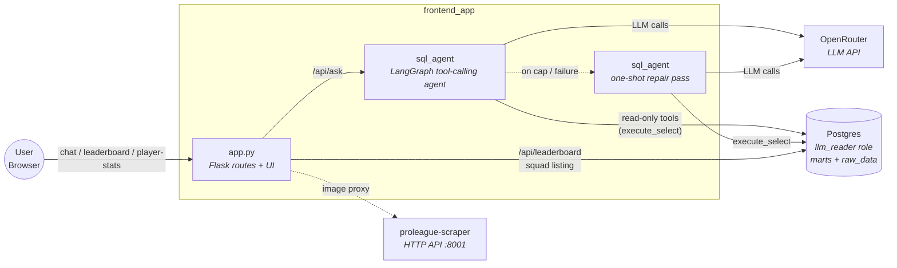

# frontend_app

Flask UI + JSON API for the MVP demo. This package serves the Data Q&A chat, the fan leaderboard, the player-stats page, and the settings page that persists runtime LLM configuration.

Current package split:

- `app.py` remains the thin Flask HTTP/UI orchestrator and the runtime entrypoint (`python -m frontend_app.app`).
- `sql_agent/` is a tool-calling LangChain + LangGraph agent (OpenRouter only). It owns the data tools, sqlglot guardrails, and graph orchestration that turns a question into a validated SELECT, executes it as `llm_reader`, and returns a Markdown answer.
- `static/` still contains the browser assets served by the Flask routes; those files were not moved.
- Tests intentionally still patch symbols on `frontend_app.app`, so the orchestration surface stays at the package root even though most pipeline internals moved into `sql_agent/`.

## How to run (at a glance)

| | |
| --- | --- |
| **Recommended** | From the repo root: **`docker compose up -d`** — the **`frontend-app`** service serves <http://localhost:8080> (see [`../../docker/README.md`](../../docker/README.md)). |
| **Host `uv`** | Optional **developer-only** path for debugging the Flask app (`uv run python -m frontend_app.app` after `uv sync --extra api`). **Not** the primary way to run the demo UI. |

## High-level flow



## Screenshots

### Chat UI


### Fan leaderboard


### Player stats


## What it serves

| Surface | What it does |
| --- | --- |
| Data Q&A (`/`) | Natural-language question -> SQL -> answer flow over Postgres. The chat model dropdown groups models by provider (Google, GPT, Grok, Mistral, Claude) and only affects the SQL agent model — the repair model is controlled independently via config/env. |
| Leaderboard (`/leaderboard`) | Reads `mart_fan_loyalty` and ranks fans |
| Player stats (`/player-stats`) | Compares cached squad data and can fetch individual player details |
| Settings (`/settings`) | Persists runtime OpenRouter settings |

## Run in Docker Compose (recommended)

1. Copy `.env.example` to `.env`.
2. Start the **full stack** with `docker compose up -d` from the repo root.
3. Set `OPENROUTER_API_KEY` (and optionally `OPENROUTER_AGENT_MODEL` / `OPENROUTER_REPAIR_MODEL`) in `.env`.
4. Wait for dbt to materialize the marts (`docker compose logs -f dbt-scheduler`).
5. Open <http://localhost:8080>.

Quick API smoke test:

```bash
curl -s -X POST http://localhost:8080/api/ask \
  -H "Content-Type: application/json" \
  -d "{\"question\":\"Who are the top 5 fans by total spend?\"}"
```

## Run on the host (optional / developer-only)

For local debugging only — **not** the supported path for running the MVP demo.

```bash
uv sync --extra api
uv run python -m frontend_app.app
```

When the API runs on your machine against the Compose Postgres instance, use host-friendly DSNs (`localhost:<POSTGRES_PORT>`) instead of the Compose-internal `postgres:5432` addresses from `.env.example`.

## Runtime configuration

### Provider and app settings

| Variable | Default | Purpose |
| --- | --- | --- |
| `LLM_READER_DATABASE_URL` | falls back to `DATABASE_URL` | Read-only Postgres DSN used for SQL execution |
| `DATABASE_URL` | unset | Fallback DB connection for read-only queries |
| `OPENROUTER_API_KEY` | unset | OpenRouter API key (required) |
| `OPENROUTER_BASE_URL` | `https://openrouter.ai/api/v1` | OpenRouter API base URL |
| `OPENROUTER_MODEL` | first built-in default | Fallback OpenRouter model id (used when neither agent_model nor repair_model is set) |
| `OPENROUTER_AGENT_MODEL` | unset | Default model for the primary tool-calling agent (falls back to `OPENROUTER_MODEL`) |
| `OPENROUTER_REPAIR_MODEL` | unset | Default model for the one-shot SQL repair pass (falls back to `OPENROUTER_AGENT_MODEL`) |
| `OPENROUTER_MODELS` | built-in defaults | Comma-separated suggestion list for the settings UI |
| `OPENROUTER_MODELS_BY_PROVIDER` | built-in defaults | JSON object mapping provider group keys (`google`, `gpt`, `grok`, `mistral`, `claude`) to lists of OpenRouter model ids for the chat UI model dropdown |
| `OPENROUTER_TIMEOUT` | `120` | OpenRouter request timeout in seconds |
| `AGENT_MAX_TOOL_ITERATIONS` | `8` | Max internal tool-call iterations per agent invocation (clamped 1–25). Applies separately to both the primary agent and the repair agent — it is not the number of repair passes. Primary agent uses this value directly; repair agent cap = `max(3, value // 2)`. |
| `LLM_CONFIG_PATH` | `src/frontend_app/llm_config.json` or `/data/llm_config.json` in Compose | JSON file for persisted runtime config |
| `PROLEAGUE_SCRAPER_URL` | `http://proleague-scraper:8001` | Internal scraper base URL for the image proxy route |
| `PORT` | `8080` | Direct app port when running manually |

### Schema and semantic prompt context

| Variable | Default | Purpose |
| --- | --- | --- |
| `SCHEMA_FILES` | unset | Highest-priority comma-separated list of dbt schema files |
| `DBT_MODELS_DIR` | unset | Folder scan mode for `*_schema.yaml` plus `marts/schema.yml` |
| `SCHEMA_FILE` | `src/frontend_app/sql_agent/schema.yml` | Single-file fallback when the dbt-derived inputs are unset |
| `DBT_RELATION_SCHEMA` | `dbt_dev` | Schema name echoed into the SQL prompt |
| `SCHEMA_CONTEXT_MAX_CHARS` | `0` | Maximum merged schema length (`0` means unlimited) |
| `SCHEMA_CONTEXT_OVERFLOW` | `error` | Overflow mode: `error` or `truncate` |
| `SEMANTIC_LAYER_FILE` | `src/frontend_app/sql_agent/semantic/semantic_layer.yml` | Optional semantic layer YAML path |
| `SEMANTIC_CONTEXT_MAX_CHARS` | `0` | Maximum rendered semantic-layer length (`0` means unlimited) |

## Routes

| Method | Path | Purpose |
| --- | --- | --- |
| `GET` | `/` | Main chat UI |
| `GET` | `/leaderboard` | Fan leaderboard page |
| `GET` | `/player-stats` | Player stats comparison page |
| `GET` | `/settings` | Settings page |
| `GET` | `/health` | Health check |
| `GET` | `/api/leaderboard?window=all` | Live all-time leaderboard from `mart_fan_loyalty` |
| `GET` | `/api/llm-config` | Read public runtime config |
| `PUT` | `/api/llm-config` | Persist runtime config changes |
| `POST` | `/api/ask` | Non-streaming question -> SQL -> answer flow |
| `POST` | `/api/ask/stream` | Streaming SSE version of the same pipeline |
| `GET` | `/api/player-stats/squad` | Cached Club Brugge squad from Postgres |
| `GET` | `/api/player-stats/image?url=<url>` | Server-side image proxy for approved league CDNs |

## How the Data Q&A flow works

In one sentence: English question -> tool-calling agent discovers the schema and writes a SELECT -> sqlglot validates it -> the app runs a bounded read-only query -> the agent turns the result rows into a Markdown answer (with a one-shot repair pass on a separate model if needed).

Current pipeline:

1. The browser sends a question, an `agent_model` override (selected from the provider-grouped model dropdown), and a small slice of recent conversation. The `repair_model` is never overridden from the chat UI.
2. `app.py` builds an `AgentRequest` (question + conversation context + model overrides) and hands it to `sql_agent.graph.run_ask` (or `run_ask_stream`).
3. The **primary agent** (LangGraph `create_react_agent` over OpenRouter) discovers schema and semantic-layer hints by calling read-only tools — `list_tables`, `describe_table`, `search_columns`, `sample_table`, `get_semantic_layer` — and finally calls `execute_select` with one PostgreSQL `SELECT` or `WITH ... SELECT` statement.
4. `execute_select` strips fences, rewrites `marts.x` / `staging.x` / `intermediate.x` to the dbt schema, runs **sqlglot** (single-statement check + AST DDL/DML rejection + legacy regex), then executes the SQL as the `llm_reader` role.
5. The agent reads back the rows from the tool result and produces a Markdown answer.
6. If the primary agent never produced a successful `execute_select` (or hit the iteration cap), a **one-shot repair pass** runs on the configured `repair_model` with a smaller toolset (`describe_table` + `execute_select`). **Exactly one repair pass is allowed per request — it is never retried.** The repair agent itself may take several internal tool-call iterations (up to `max(3, AGENT_MAX_TOOL_ITERATIONS // 2)`); if those are exhausted the request fails with an `"iteration_cap"` error, not a second repair attempt.

### Guardrails

| Guardrail | Detail |
| --- | --- |
| Read-only SQL only | `execute_select` is the only tool that runs free-form SQL |
| sqlglot single-statement | Multi-statement input is rejected at parse time |
| sqlglot AST DDL/DML reject | `Insert`, `Update`, `Delete`, `Drop`, `Create`, `Alter`, `TruncateTable`, `Merge`, `Copy`, `Command` nodes are rejected before execution |
| Legacy regex fallback | Mutating keyword regex runs as a second pass |
| Identifier whitelist | `describe_table` / `sample_table` reject any table not present in `list_tables()` output |
| Outer row cap | Execution is wrapped in an outer `LIMIT 100` |
| Time limit | Every DB session sets `statement_timeout` to 10 seconds |
| Bounded iterations | Primary agent capped by `AGENT_MAX_TOOL_ITERATIONS` (default 8); repair agent has its own separate cap of `max(3, value // 2)`. Both caps limit internal tool-call steps within a single invocation — not the number of repair passes. Only one repair pass ever runs per request. |

### Streaming details

`POST /api/ask/stream` emits Server-Sent Events with `progress`, `meta`, `answer_delta`, `done`, or `error` events. Successful follow-up questions also carry a small history window so prompts like "these fans" or "that match" stay scoped.

`progress` events are advisory UX updates intended for "thinking out loud" feedback. Each payload includes:

- `step_key` — stable machine key for the stage/tool step
- `title` — short user-facing status line
- `detail` — brief factual explanation of what is happening
- `phase` — `primary`, `repair`, or `final`
- `ts` — UTC ISO8601 timestamp

### What the model sees vs what the UI gets

| Variable | Contents | Consumer |
| --- | --- | --- |
| `preview` | Up to 20 executed rows as JSON | Second LLM call |
| `data_preview` | First 20 executed rows from a result set capped at `LIMIT 100` | HTTP JSON response and SSE `meta` event |

## Leaderboard scoring (current v1)

`GET /api/leaderboard` reads `dbt_dev.mart_fan_loyalty` and computes:

```text
points = ROUND(
    CASE WHEN matches_attended > 0 THEN 1000 ELSE 0 END
    + 150 * matches_attended
    + total_spend
    + 5 * merch_purchase_count
    + 5 * retail_purchase_count
)::bigint
```

Tie-breakers are `points DESC`, `matches_attended DESC`, `total_spend DESC`, then `fan_id ASC`.

## Observability

### Log level

Set `LOG_LEVEL=DEBUG` (default: `INFO`) to enable verbose output including SQL queries, DB timing, and LLM/tool round-trip details.

```bash
# Docker Compose — add to .env or docker-compose.yml environment block
LOG_LEVEL=DEBUG
```

### Log format

Every log line carries a short **request ID** (`[req_id]`) that is generated per HTTP request and propagated through the full call stack (Flask → `run_ask` → agent stages → tools → DB):

```
2026-04-24 21:30:01,123 INFO  [a3f1c2d8] frontend_app.app — POST /api/ask/stream question="show top fans"
2026-04-24 21:30:01,124 INFO  [a3f1c2d8] frontend_app.sql_agent.graph — run_ask start: question="show top fans"
2026-04-24 21:30:01,125 INFO  [a3f1c2d8] frontend_app.sql_agent.graph — Stage start: stage=primary model=deepseek/deepseek-v3.2 tools=6 max_iter=8
2026-04-24 21:30:01,130 INFO  [a3f1c2d8] frontend_app.sql_agent.observability — LLM call start | model=deepseek/deepseek-v3.2
2026-04-24 21:30:04,500 INFO  [a3f1c2d8] frontend_app.sql_agent.observability — LLM call end — 3370 ms
2026-04-24 21:30:04,501 INFO  [a3f1c2d8] frontend_app.sql_agent.observability — Tool call start: list_tables | args={}
2026-04-24 21:30:04,508 INFO  [a3f1c2d8] frontend_app.sql_agent.observability — Tool call end: list_tables — 7 ms | output=[{"name":…
2026-04-24 21:30:10,200 INFO  [a3f1c2d8] frontend_app.sql_agent.observability — Tool call start: execute_select | args={"sql": "SELECT…
2026-04-24 21:30:10,320 INFO  [a3f1c2d8] frontend_app.sql_agent.tools — execute_select done: 100 rows, 120 ms
2026-04-24 21:30:10,321 INFO  [a3f1c2d8] frontend_app.sql_agent.observability — Tool call end: execute_select — 121 ms | output={"rows"…
2026-04-24 21:30:12,000 INFO  [a3f1c2d8] frontend_app.sql_agent.graph — Stage primary done: 10875 ms, 9 messages
2026-04-24 21:30:12,001 INFO  [a3f1c2d8] frontend_app.sql_agent.graph — run_ask done: repaired=False rows=100
2026-04-24 21:30:12,002 DEBUG [a3f1c2d8] frontend_app.app — SSE event: meta
2026-04-24 21:30:12,003 DEBUG [a3f1c2d8] frontend_app.app — SSE event: answer_delta
2026-04-24 21:30:12,004 DEBUG [a3f1c2d8] frontend_app.app — SSE event: done
2026-04-24 21:30:12,005 INFO  [a3f1c2d8] frontend_app.app — stream closed
```

### Diagnosing a "spinning forever" question

1. **Tail the logs**: `docker compose logs -f frontend-app`
2. **Find the request ID** from the first `POST /api/ask/stream` line for the question in question.
3. **Filter by req_id**: `docker compose logs frontend-app | grep '\[a3f1c2d8\]'`
4. **Identify the hang point**:
   - Stuck after `LLM call start` → the LLM is taking too long; check `OPENROUTER_TIMEOUT` (default 120 s) and the model's latency.
   - Stuck after `Tool call start: execute_select` → the DB query is hanging; the `statement_timeout` (10 s) should kill it, but a slow connection setup (no connect timeout is set) could delay the error.
   - `Stage X: iteration cap hit` warning → the agent hit `AGENT_MAX_TOOL_ITERATIONS * 2 + 5` LangGraph steps without producing a valid SQL result; increase `AGENT_MAX_TOOL_ITERATIONS` or the repair-pass model.
   - No `run_ask start` after the HTTP log → the request was rejected at validation before entering the agent pipeline.

### Known hang paths

| Cause | Symptom in logs | Mitigation |
| --- | --- | --- |
| Slow LLM (default `OPENROUTER_TIMEOUT=120s` × up to 8 tool iterations) | Long gap between `LLM call start` and `LLM call end` | Reduce `AGENT_MAX_TOOL_ITERATIONS`; use a faster model |
| `GraphRecursionError` (iteration cap) | `WARNING … iteration cap hit` then `run_ask failed: phase=iteration_cap` | Increase `AGENT_MAX_TOOL_ITERATIONS`; simplify the question |
| Slow DB connection (no connect timeout) | `DB query: sql=…` appears but `DB query done` never follows | Add `connect_timeout=5` to `DATABASE_URL` DSN parameters |

## Troubleshooting

| Problem | What to check |
| --- | --- |
| Provider errors in `/api/ask` | OpenRouter API key missing or invalid, model id not accessible, or rate-limited |
| Host-run API cannot reach Postgres | Use `localhost:<POSTGRES_PORT>` in the DSN, not the Compose hostname `postgres` |
| `relation "mart_player_season_summary" does not exist` in `/api/ask` | Ensure dbt has built player marts (default selector is `+mart_fan_loyalty +mart_player_season_summary`), then check `docker compose logs -f dbt-scheduler` |
| `/player-stats` shows no players | The first scrape has not completed yet; check `proleague-scheduler` and `proleague-ingest` logs |
| Player images do not load | The proxy route is `/api/player-stats/image`; inspect `docker compose logs -f frontend-app` for upstream/proxy errors |
| Schema-context startup error | Check `SCHEMA_FILES`, `DBT_MODELS_DIR`, `SCHEMA_FILE`, and the overflow settings |

## Related docs

- [`../../README.md`](../../README.md) - repo-level overview
- [`../../docker/README.md`](../../docker/README.md) - Compose stack and operator commands
- [`../../dbt/README.md`](../../dbt/README.md) - dbt setup and the models this API reads
- [`./sql_agent/README.md`](sql_agent/README.md) - SQL agent internals (graph, tools, guardrails)
- [`../proleague_scraper/README.md`](../proleague_scraper/README.md) - internal player-scraper service
- [`../proleague_ingest/README.md`](../proleague_ingest/README.md) - cached `player_stats` ingest path
