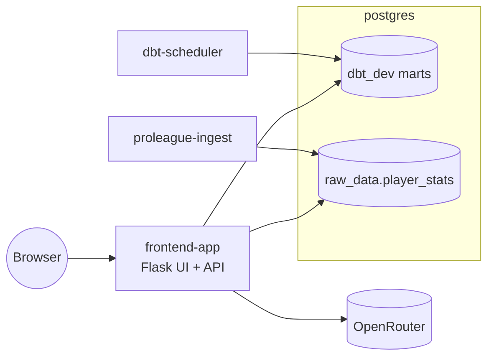

# frontend_app

This module serves the browser UI, leaderboard, player snapshot, and Data Q&A API that operators use once the stack is up.

Start the stack from [`../../README.md`](../../README.md); this runbook covers the `frontend-app` service that Compose starts for you.

## Compose service mapping

| Compose service | Role |
| --- | --- |
| `frontend-app` | Host-facing Flask UI and JSON API on `${LLM_API_PORT:-8080}` |

## How this module fits the stack



## Prerequisites / dependencies

| Dependency | Why it matters |
| --- | --- |
| `dbt-scheduler` | The leaderboard and chat read dbt marts built in `dbt_dev`. |
| `proleague-ingest` | The player page reads cached rows from `raw_data.player_stats`. |
| `postgres` | `frontend-app` uses the read-only database URL to query both marts and player snapshots. |
| OpenRouter API access | Data Q&A requires `OPENROUTER_API_KEY`. |

If the player pipeline has not ingested a first squad snapshot yet, the player page will load but show no cached players.

## Key environment variables

| Variable | Override when | Notes |
| --- | --- | --- |
| `OPENROUTER_API_KEY` | You want Data Q&A to work | Required for chat requests. |
| `OPENROUTER_MODEL` | You want a different default chat model | Used when agent-specific overrides are unset. |
| `OPENROUTER_AGENT_MODEL` | You want a dedicated primary SQL-agent model | Optional override for the main agent. |
| `OPENROUTER_REPAIR_MODEL` | You want a dedicated repair-pass model | Optional override for the repair pass. |
| `LLM_READER_DATABASE_URL` | Postgres host, port, database, or password changes | Must point to the read-only `llm_reader` role. |
| `LLM_API_PORT` | Host port `8080` is busy | Controls the published UI/API port. |

## Operator check

```bash
docker compose logs -f frontend-app
```

## Related runbooks

| Area | README or spec |
| --- | --- |
| Stack entry point | [`../../README.md`](../../README.md) |
| Compose service runbook | [`../../docker/README.md`](../../docker/README.md) |
| dbt scheduler | [`../../dbt/README.md`](../../dbt/README.md) |
| SQL agent | [`./sql_agent/README.md`](sql_agent/README.md) |
| Player-stats ingest | [`../proleague_ingest/README.md`](../proleague_ingest/README.md) |
