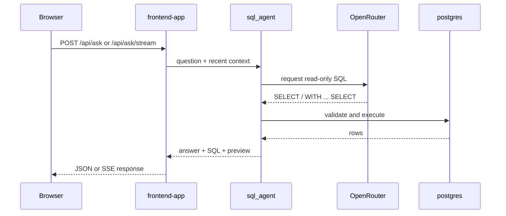

# sql_agent

This module turns chat questions into validated read-only SQL so `frontend-app` can answer against Postgres without giving the model write access.

Start the stack from [`../../../README.md`](../../../README.md); this runbook describes the SQL agent that runs inside the `frontend-app` service.

## Compose service mapping

| Compose service | Role |
| --- | --- |
| `frontend-app` | Hosts the SQL agent; there is no separate `sql_agent` Compose service |

## How this module fits the stack



## Prerequisites / dependencies

| Dependency | Why it matters |
| --- | --- |
| `frontend-app` | The SQL agent is loaded inside the Flask service. |
| `postgres` | Queries run against dbt marts and `raw_data.player_stats`. |
| `dbt-scheduler` | Supplies the marts the SQL agent is expected to query. |
| OpenRouter API access | The agent requires `OPENROUTER_API_KEY`. |
| `LLM_READER_DATABASE_URL` | Must point to the read-only database role used for SQL execution. |

## Key environment variables

| Variable | Override when | Notes |
| --- | --- | --- |
| `OPENROUTER_API_KEY` | You want the SQL agent to answer questions | Required. |
| `OPENROUTER_AGENT_MODEL` | You want a different primary agent model | Optional override for the main SQL generation pass. |
| `OPENROUTER_REPAIR_MODEL` | You want a different repair-pass model | Optional override for the recovery pass. |
| `AGENT_MAX_TOOL_ITERATIONS` | You want a higher or lower tool-call budget | Default is `8`. |
| `LLM_READER_DATABASE_URL` | Postgres host, port, database, or password changes | Must stay read-only. |

## Operator check

```bash
docker compose logs -f frontend-app
```

## Related runbooks

| Area | README or spec |
| --- | --- |
| Stack entry point | [`../../../README.md`](../../../README.md) |
| Host-facing Flask UI | [`../README.md`](../README.md) |
| dbt scheduler | [`../../../dbt/README.md`](../../../dbt/README.md) |
| Compose service runbook | [`../../../docker/README.md`](../../../docker/README.md) |
