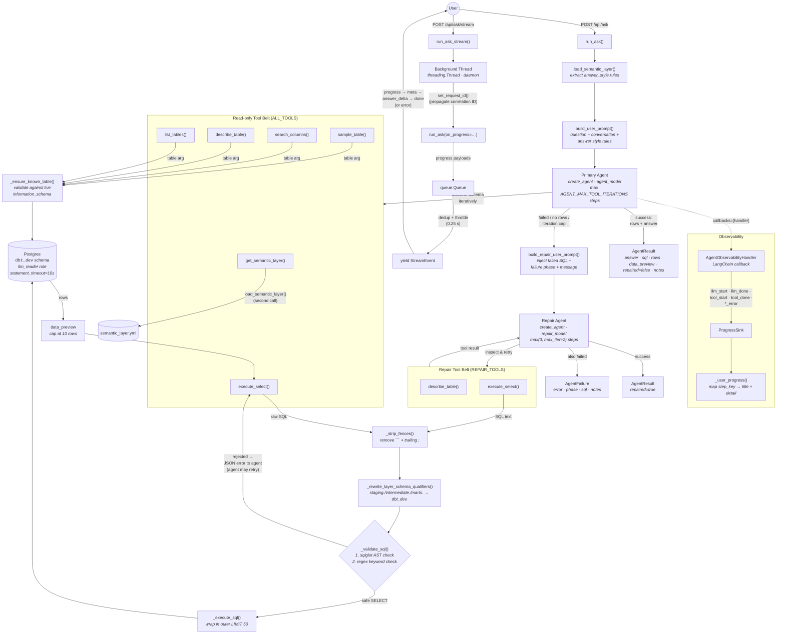

# SQL Agent — Text-to-SQL Chat Pipeline

The `frontend-app` exposes a Data Q&A chat at `/api/ask` (synchronous JSON) and `/api/ask/stream` (Server-Sent Events). User questions are handled by a LangGraph-based SQL agent with a two-stage primary + repair architecture, real-time progress streaming, and a multi-layer security design.

## Architecture diagram

**Legend:** solid arrows = primary data/control flow; dashed arrows = async / callback-driven flow.

## Key points

- **Two-stage pipeline.** A primary ReAct agent (using `agent_model`) gets the full 6-tool belt. If it fails to produce a successful `execute_select` result, a repair agent (using `repair_model`) is invoked with only `describe_table` + `execute_select`. At most one repair pass runs per request.
- **Dual SQL guardrail.** Every SQL string passed to `execute_select` is pre-processed (`_strip_fences` → `_rewrite_layer_schema_qualifiers`) then validated in two layers: (1) sqlglot parses the Postgres dialect AST and rejects any mutating node type (`_MUTATING_AST_TYPES`: Insert, Update, Delete, Drop, Create, Alter, TruncateTable, Merge, Copy, Command) or multi-statement input; (2) a regex (`_MUTATING`) rejects residual keywords (INSERT, UPDATE, DELETE, DROP, GRANT, REVOKE, SET ROLE, etc.) and stray semicolons. Rejection returns a structured JSON error (`{"error": "...", "phase": "validation", "sql": "..."}`) to the agent — not a hard exception — so the agent can fix the SQL and retry.
- **Identifier whitelisting.** All tools that accept a `table` argument (`describe_table`, `sample_table`, `search_columns`, `list_tables` internally) validate the identifier format (`[A-Za-z_][A-Za-z0-9_]*`) and then check it against live `information_schema.tables` for the dbt schema via `_ensure_known_table` before any SQL is constructed.
- **SQL post-processing.** `_execute_sql` wraps the validated SQL in `SELECT * FROM (\n{sql}\n) AS llm_query LIMIT 50` to hard-cap row count. The `data_preview` field returned to the caller is further capped at 10 rows (`_result_to_data_preview`).
- **Database role.** The DB connection uses the `llm_reader` Postgres role (SELECT-only on `dbt_dev` + `raw_data.player_stats`) with `statement_timeout = '10s'` set on every connection.
- **Iteration caps.** `AGENT_MAX_TOOL_ITERATIONS` (env var, default 8, clamped 1–25) controls the primary agent's `recursion_limit` (`max_iter * 2 + 5`). The repair agent cap is `max(3, max_iter // 2)`.
- **`AgentFailure.phase` values:** `"validation"` (guardrail rejected SQL), `"execution"` (Postgres runtime error or uncaught exception), `"no_sql"` (agent finished without calling `execute_select`), `"iteration_cap"` (exceeded `GraphRecursionError`).
- **`AgentResult` trace fields.** `repaired: bool` indicates whether the repair agent produced the final answer. `notes: list[str]` is a human-readable trace log of what happened (model used, repair triggered, etc.).
- **Semantic layer.** `load_semantic_layer()` is called **twice** per request: once in `run_ask` to extract `answer_style.rules` for the user prompt, and again when the agent calls the `get_semantic_layer()` tool at runtime to learn about subjects, metrics, dimensions, join paths, and layering rules.
- **LLM config system.** OpenRouter is the only provider. Model precedence for `agent_model`: per-request override > `agent_model` setting > legacy `openrouter_model`. `repair_model` falls back to the resolved `agent_model` when unset. Settings are seeded from env vars, overlaid by an optional `LLM_CONFIG_PATH` JSON file at startup, and updatable at runtime via `PUT /api/llm-config`.
- **Observability.** `AgentObservabilityHandler` is a LangChain `BaseCallbackHandler` that emits timing events (`llm_start`, `llm_done`, `tool_start`, `tool_done`, `*_error`) into a `ProgressSink`. In streaming mode, these are mapped through `_user_progress()` into user-friendly `StreamEvent("progress", ...)` payloads with football-themed titles and details.
- **Request-ID propagation.** `set_request_id` is called in the `run_ask_stream` worker thread to propagate the correlation ID (a `ContextVar`) across the thread boundary. `reset_request_id` restores the previous value on thread exit.
- **Repair prompt construction.** `build_repair_user_prompt` injects the failed SQL, failure phase (`"validation"` / `"execution"` / `"no_sql"`), and failure message into the repair agent's user prompt so it has full context to diagnose and fix.

## SSE streaming event reference

`run_ask_stream` yields `StreamEvent(name, data)` objects. The frontend receives these as Server-Sent Events. Events are emitted in the order shown below.

| Event name | Payload shape | Description |
| --- | --- | --- |
| `progress` | `{"step_key": str, "title": str, "detail": str, "phase": str, "ts": str}` | Emitted throughout the agent run. `step_key` values: `run_start`, `llm_start`, `llm_done`, `tool_start`, `tool_done`, `repair_start`, `finalizing`, `llm_error`, `tool_error`, `run_error`. `phase` is `"primary"`, `"repair"`, or `"final"`. Duplicate `(step_key, phase, title, detail)` tuples are throttled to at most one per 0.25 s. |
| `meta` | `{"sql": str, "data_preview": list[dict], "trace_notes": list[str], "repaired": bool}` | Emitted once after the agent completes successfully. Contains the executed SQL, up to 10 preview rows, the `notes` trace log, and whether the repair pass was used. |
| `answer_delta` | `{"text": str}` | One or more chunks of the Markdown answer. The answer is split on `\n\n` paragraph boundaries to give a streaming feel without re-invoking the LLM. Each chunk has `\n\n` appended. |
| `done` | `{}` | Terminal event: the stream is complete. |
| `error` | `{"message": str, "phase"?: str, "sql"?: str, "notes"?: list[str]}` | Terminal event: the agent failed. On `AgentFailure`, includes `phase`, `sql`, and `notes`. On uncaught exceptions, only `message` is present. |

**Threading model:** `run_ask_stream` spawns a daemon `threading.Thread` that calls `run_ask(on_progress=...)`. Progress payloads flow through a `queue.Queue`. The main thread polls the queue (100 ms timeout), deduplicates, throttles, and yields `StreamEvent` objects. A `threading.Event` signals worker completion. After the worker finishes, any remaining queued progress events are drained before emitting `meta` / `answer_delta` / `done` (or `error`).

## Configuration reference

### Environment variables

| Variable | Default | Description |
| --- | --- | --- |
| `OPENROUTER_API_KEY` | _(none)_ | **Required.** OpenRouter API key. Never exposed in full to clients (GET returns a masked suffix). |
| `OPENROUTER_BASE_URL` | `https://openrouter.ai/api/v1` | OpenRouter API base URL. |
| `OPENROUTER_MODELS` | `deepseek/deepseek-v3.2, google/gemini-3.1-flash-lite-preview, minimax/minimax-m2.5, x-ai/grok-4.1-fast` | Comma-separated model catalog for the UI model picker. |
| `OPENROUTER_TIMEOUT` | `120` | HTTP timeout in seconds for OpenRouter requests (valid: 1–600). |
| `OPENROUTER_AGENT_MODEL` | _(none)_ | Explicit agent model override. Takes precedence over `OPENROUTER_MODEL`. |
| `OPENROUTER_REPAIR_MODEL` | _(none)_ | Explicit repair model override. Falls back to the resolved agent model. |
| `OPENROUTER_MODEL` | `deepseek/deepseek-v3.2` | Legacy default model. Used as agent model when `OPENROUTER_AGENT_MODEL` is unset. |
| `AGENT_MAX_TOOL_ITERATIONS` | `8` | Max tool iterations for the primary agent (clamped 1–25). Repair cap = `max(3, value // 2)`. |
| `SEMANTIC_LAYER_FILE` | `semantic/semantic_layer.yml` (beside the module) | Path to the semantic layer YAML. If explicitly set but missing, raises `SemanticLayerError`. |
| `SEMANTIC_CONTEXT_MAX_CHARS` | `0` (uncapped) | Max characters for the rendered semantic context. `0` = no limit; exceeding truncates with a banner. |
| `DBT_RELATION_SCHEMA` | `dbt_dev` | Postgres schema where dbt builds all relations. Used by all tools for `information_schema` lookups. |
| `LLM_CONFIG_PATH` | `src/frontend_app/llm_config.json` | Path to the persisted JSON config overlay. Created/updated by `PUT /api/llm-config`. |
| `LLM_READER_DATABASE_URL` | _(none)_ | Postgres connection string for the `llm_reader` role. Falls back to `DATABASE_URL`. |
| `DATABASE_URL` | _(none)_ | Fallback Postgres connection string. |
| `DBT_MODELS_DIR` | _(none)_ | Directory of dbt model YAML files for column descriptions in tool responses (auto-discovers `*_schema.yaml` and `marts/schema.yml`). |

### LLM config precedence

1. Environment variables seed the defaults at startup.
2. If `LLM_CONFIG_PATH` points to an existing JSON file, its keys overlay the env defaults (persisted settings win).
3. `PUT /api/llm-config` updates the in-memory state and atomically rewrites the JSON file.

Model role resolution:

- **`agent_model`**: per-request override → `agent_model` setting → legacy `openrouter_model`.
- **`repair_model`**: per-request override → `repair_model` setting → resolved `agent_model`.

## Security design

| Layer | Mechanism | Detail |
| --- | --- | --- |
| **Database role** | `llm_reader` Postgres role | SELECT-only on `dbt_dev.*` and `raw_data.player_stats`. No write, DDL, or admin privileges. Created by `docker/postgres/init/002_llm_reader.sql`. |
| **SQL guardrail — AST** | sqlglot parse + walk | Parses the SQL as Postgres dialect. Rejects: parse failures, multi-statement input, non-SELECT top-level nodes, and any node matching `_MUTATING_AST_TYPES` (Insert, Update, Delete, Drop, Create, Alter, AlterColumn, TruncateTable, Merge, Copy, Command) anywhere in the tree. |
| **SQL guardrail — regex** | `_MUTATING` regex | Belt-and-braces second pass: rejects INSERT, UPDATE, DELETE, DROP, TRUNCATE, ALTER, CREATE, REPLACE, GRANT, REVOKE, EXECUTE, EXEC, CALL, COPY, VACUUM, ANALYZE, COMMENT, LOCK, CLUSTER, REINDEX, REFRESH, SET ROLE, RESET. Also rejects stray `;` characters. |
| **SQL pre-processing** | `_strip_fences` + `_rewrite_layer_schema_qualifiers` | Strips markdown code fences and trailing semicolons; rewrites `staging.`/`intermediate.`/`marts.` prefixes to `dbt_dev.` (LLMs sometimes infer layer labels as SQL schemas). |
| **Identifier whitelisting** | `_ensure_known_table` | Format-validated (`[A-Za-z_][A-Za-z0-9_]*` regex) and checked against live `information_schema.tables` for the dbt schema before any SQL is constructed. Prevents injection via fabricated table names. |
| **Statement timeout** | `SET statement_timeout = '10s'` | Set on every `_run_read_query` connection. Kills runaway queries server-side. |
| **Row cap** | `LIMIT 50` outer wrap | `_execute_sql` wraps all agent SQL in `SELECT * FROM (...) AS llm_query LIMIT 50`. |
| **Preview cap** | `data_preview` ≤ 10 rows | `_result_to_data_preview` slices to the first 10 rows before returning to the caller/SSE stream. |
| **No schema in prompt** | Tools-based discovery | The system prompt contains no table or column names. The agent must call `list_tables`, `describe_table`, etc. to discover schema, reducing the risk of prompt-injected SQL targeting known columns. |
| **Guardrail errors are soft** | Structured JSON, not exceptions | Validation failures return `{"error": "...", "phase": "validation", "sql": "..."}` to the agent as a tool response, allowing it to self-correct rather than crashing the pipeline. |
| **Tool result caps** | `_MAX_*` constants | `_MAX_TABLES_RETURNED=200`, `_MAX_COLUMNS_RETURNED=300`, `_MAX_SEARCH_RESULTS=100`, `_MAX_SAMPLE_ROWS=10` — bounds context window usage and prevents the agent from pulling the full database into its prompt. |
| **API key masking** | `to_public_config()` | `GET /api/llm-config` returns only the last 4 characters of the OpenRouter API key, prefixed with `****`. |
