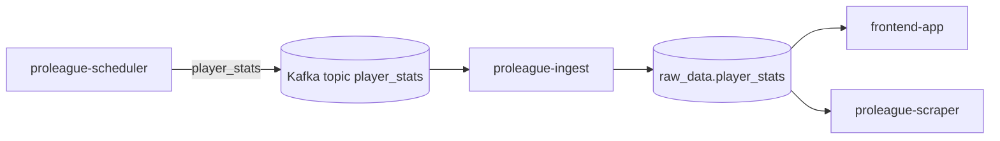

# proleague_ingest

This module consumes `player_stats` messages from Kafka and upserts the latest squad snapshot into Postgres for the rest of the stack.

Start the stack from [`../../README.md`](../../README.md); this runbook covers the `proleague-ingest` service that Compose starts for you.

## Compose service mapping

| Compose service | Role |
| --- | --- |
| `proleague-ingest` | Consumes `player_stats` and writes `raw_data.player_stats` |

## How this module fits the stack



## Prerequisites / dependencies

| Dependency | Why it matters |
| --- | --- |
| `broker` | `proleague-ingest` consumes from Kafka inside the Compose network. |
| `kafka-init-scraper` | Creates the `player_stats` topic before the consumer subscribes. |
| `postgres` | `proleague-ingest` writes the latest player snapshot into the shared database. |
| `proleague-scheduler` | Supplies the player messages this service persists. |

## Key environment variables

| Variable | Override when | Notes |
| --- | --- | --- |
| `KAFKA_BOOTSTRAP_SERVERS` | Kafka lives somewhere other than `broker:29092` | Compose default is already correct for the local stack. |
| `SCRAPER_KAFKA_TOPIC` | You want a different topic name | Must stay aligned with `proleague-scheduler`. |
| `SCRAPER_KAFKA_CONSUMER_GROUP` | You want a different consumer-group identity | Default is `scraper-ingest-local`. |
| `DATABASE_URL` | Postgres host, port, database, or password changes | Must point to a write-capable Postgres role. |

## Operator check

```bash
docker compose logs -f proleague-ingest
```

## Related runbooks

| Area | README or spec |
| --- | --- |
| Stack entry point | [`../../README.md`](../../README.md) |
| Compose service runbook | [`../../docker/README.md`](../../docker/README.md) |
| Upstream scheduler and HTTP layer | [`../proleague_scraper/README.md`](../proleague_scraper/README.md) |
| Host-facing UI | [`../frontend_app/README.md`](../frontend_app/README.md) |
