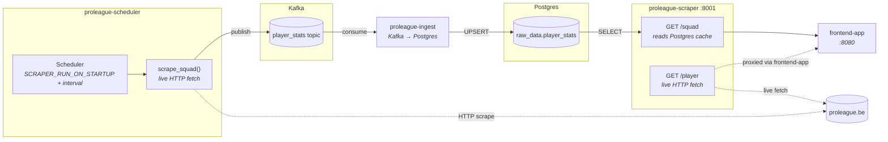

# proleague_scraper

Pro League squad scraper package for the player-stats pipeline. In the local stack it is used in two ways: as the `proleague-scheduler` service that scrapes Club Brugge player data and publishes Kafka messages, and as the `proleague-scraper` service that exposes a small internal HTTP read layer.

## How to run (at a glance)

| | |
| --- | --- |
| **Recommended** | **`docker compose up -d`** from the repo root (includes `proleague-scheduler` and `proleague-scraper`). See [`../../docker/README.md`](../../docker/README.md). |
| **Host `uv`** | Not a supported operator path for this package — images and Compose are the supported runtime. |

> Operators are responsible for checking <https://www.proleague.be/robots.txt> and the site's Terms of Use before running this against the live site anywhere outside a local MVP setup.

## Surfaces in this package

| Surface | Entry point | What it does |
| --- | --- | --- |
| Scheduler | `python -m proleague_scraper.scheduler` | Scrapes the squad on startup and then every `SCRAPER_INTERVAL_HOURS`, publishing one Kafka message per player |
| HTTP read layer | `python -m proleague_scraper.app` | Serves `/health`, `/squad`, and `/player` for internal stack use |

These runtimes are packaged by [`docker/Dockerfile.scraper`](../../docker/Dockerfile.scraper) with [`docker/requirements.scraper.txt`](../../docker/requirements.scraper.txt). They are not part of the repo's `uv` extras; Docker Compose is the supported runtime path.

## How to run it

Start the player-stats part of the stack:

```bash
docker compose up -d proleague-scheduler proleague-ingest proleague-scraper
docker compose logs -f proleague-scheduler
```

Force an immediate re-scrape outside the normal interval:

```bash
docker compose restart proleague-scheduler
```

Normal browser users do not talk to this service directly. The host-facing entrypoint is the `frontend_app` player-stats page at <http://localhost:8080/player-stats>.

## High-level flow



**Note:** `Dockerfile.scraper` defaults CMD to `python -m proleague_scraper.app` (the HTTP layer). The `proleague-scheduler` Compose service overrides this with `command: ["python", "-m", "proleague_scraper.scheduler"]`.

## Environment variables

| Variable | Default | Used by |
| --- | --- | --- |
| `PROLEAGUE_SQUAD_URL` | Club Brugge squad URL | Scheduler target page override |
| `KAFKA_BOOTSTRAP_SERVERS` | `broker:29092` | Scheduler Kafka producer |
| `SCRAPER_KAFKA_TOPIC` | `player_stats` | Scheduler Kafka topic |
| `SCRAPER_INTERVAL_HOURS` | `24` | Hours between scrape runs |
| `SCRAPER_RUN_ON_STARTUP` | `1` | `1` runs immediately on container start; `0` waits one interval first |
| `DATABASE_URL` | unset | HTTP read layer DB cache for `/squad` |
| `PORT` | `8001` | Direct app port when running `python -m proleague_scraper.app` manually |
| `LOG_LEVEL` | `INFO` | Log verbosity for both the scheduler and HTTP app (`DEBUG`, `INFO`, `WARNING`) |

## Internal routes

The Compose service is not published to the host by default; these are internal stack routes.

| Route | Purpose |
| --- | --- |
| `GET /health` | Basic health check |
| `GET /squad?url=<optional>` | Reads cached squad data from Postgres; returns `players: []` until the first scrape is ingested |
| `GET /player?url=<profile_url>` | Live fetch of one player profile page (callable directly via API; not exposed in the UI) |

## Troubleshooting

| Problem | What to check |
| --- | --- |
| The player-stats page is empty | The first scrape has not completed yet; watch `docker compose logs -f proleague-scheduler` and `docker compose logs -f proleague-ingest` |
| Scheduler logs HTTP errors | proleague.be may be temporarily unreachable, or the target page may have changed |
| Cached squad stays stale | Restart `proleague-scheduler` to force an immediate scrape |
| `/squad` returns an empty list forever | Check `DATABASE_URL` for the scraper service and confirm `proleague-ingest` is persisting rows |

## Related docs

- [`../../README.md`](../../README.md) - repo-level overview
- [`../proleague_ingest/README.md`](../proleague_ingest/README.md) - consumer and table docs for `player_stats`
- [`../frontend_app/README.md`](../frontend_app/README.md) - host-facing player-stats routes and UI
- [`../../docker/README.md`](../../docker/README.md) - Compose services, env vars, and operator commands
