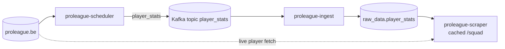

# proleague_scraper

This module fetches Club Brugge squad data from Pro League, publishes player updates to Kafka on a schedule, and exposes an internal HTTP read layer inside the Compose network.

Start the stack from [`../../README.md`](../../README.md); this runbook covers the `proleague-scheduler` and `proleague-scraper` services that Compose starts for you.

## Compose service mapping

| Compose service | Role |
| --- | --- |
| `proleague-scheduler` | Scrapes the squad page and publishes `player_stats` messages |
| `proleague-scraper` | Serves internal `/health`, `/squad`, and `/player` endpoints |

## How this module fits the stack



## Prerequisites / dependencies

| Dependency | Why it matters |
| --- | --- |
| `broker` | `proleague-scheduler` publishes `player_stats` into Kafka. |
| `kafka-init-scraper` | Creates the `player_stats` topic before the scheduler and consumer start. |
| `postgres` | `proleague-scraper` reads cached squad rows from Postgres. |
| Internet access to `www.proleague.be` | Live squad and player data comes from the source site. |
| Permission to scrape the source site | Operators should review `https://www.proleague.be/robots.txt` and the site's terms before enabling live scraping. |

The current browser UI reads cached squad rows directly from Postgres, so `proleague-scraper` is mainly for internal HTTP callers and live player lookups.

## Key environment variables

| Variable | Override when | Notes |
| --- | --- | --- |
| `PROLEAGUE_SQUAD_URL` | You need a different squad page | Defaults to the Club Brugge squad URL. |
| `SCRAPER_INTERVAL_HOURS` | You want a different refresh cadence | Default is `24`. |
| `SCRAPER_RUN_ON_STARTUP` | You want the first scrape delayed until the first interval | Default is `1` for an immediate run. |
| `SCRAPER_KAFKA_TOPIC` | You want a different topic name | Must stay aligned with `proleague-ingest`. |
| `DATABASE_URL` | Postgres host, port, database, or password changes | Used by `proleague-scraper` for cached reads. |

## Operator check

```bash
docker compose logs -f proleague-scheduler proleague-scraper
```

## Related runbooks

| Area | README or spec |
| --- | --- |
| Stack entry point | [`../../README.md`](../../README.md) |
| Compose service runbook | [`../../docker/README.md`](../../docker/README.md) |
| Downstream player ingest | [`../proleague_ingest/README.md`](../proleague_ingest/README.md) |
| Host-facing UI | [`../frontend_app/README.md`](../frontend_app/README.md) |
